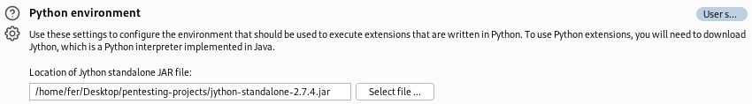
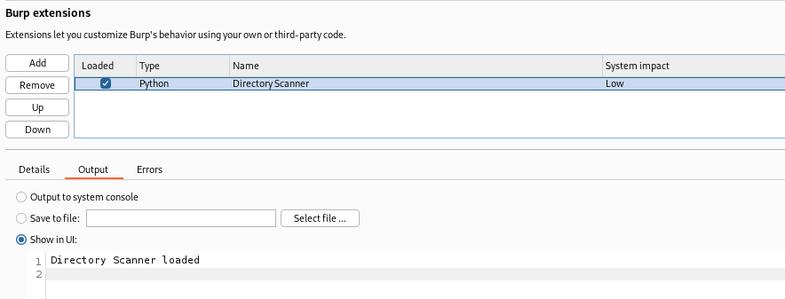
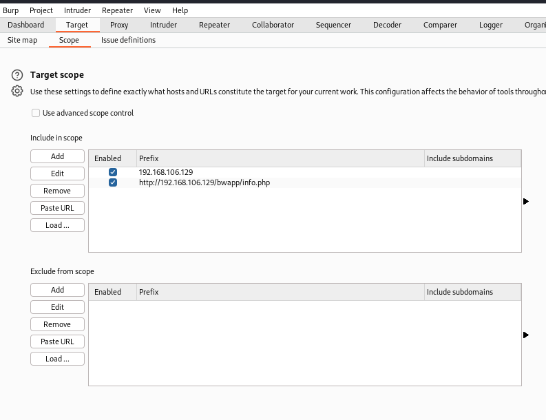
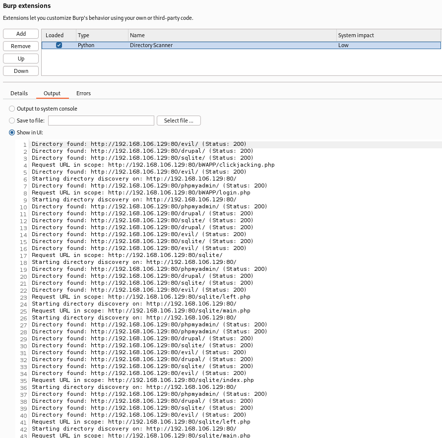

Unidad 1
ACTIVIDAD N°1

**Nombre Alumna:** Fernanda Vergara Chávez
**Nombre Profesor:** Ángel Gangas - Asistente de clases: Violeta Gangas
**Diplomado:** Red Team Avanzado
**Curso:** PENTESTING WEB AVANZADO
**Fecha de entrega:** 21/09/2024

# Introducción

Este documento contiene la evidencia de la Actividad N°1 del desarrollo de un plugin de Burp Suite en Python que realiza un descubrimiento de directorios cuando identifica un nuevo sitio web en el scope, utilizando la máquina bee box.

# Desarrollo

## I.  Ambiente, Configuraciones y Herramientas:

1. Se ha instalado el ambiente en VMWare con las máquinas virtuales pertinentes al ejercicio:

2. Jython está asociado a las extensiones de Burp Suite (Kali):

3. Archivo con el plugin de python asociado en Burp Suite (Kali):

4. Scope en Burp Suite (Kali): Se ha agregado la IP de bee box para poder obtener los directorios de bWAPP:

5. La máquina bee box está encendida para descubrir los directorios presentes en bWAPP:

## II.  Código python para el plugin:

Este código implementa un plugin para Burp Suite que realiza descubrimiento de directorios en un sitio web. Cuando se intercepta una solicitud HTTP dentro del scope de Burp, el plugin inicia un hilo para buscar directorios (como phpmyadmin, drupal, sqlite, evil) en la URL solicitada. Para cada directorio, envía una solicitud HTTP GET y verifica la respuesta, imprimiendo si el directorio fue encontrado (código 200) o no. Esto permite identificar recursos potencialmente interesantes en el sitio objetivo:

    from burp import IBurpExtender, IHttpListener
    from java.net import URL, HttpURLConnection
    import threading
    
    \# List of common directories for directory discovery
    COMMON\_DIRECTORIES = \['phpmyadmin', 'drupal', 'sqlite', 'evil'\]
    
    class BurpExtender(IBurpExtender, IHttpListener):
            def registerExtenderCallbacks(self, callbacks):
                self.\_callbacks = callbacks
                self.\_helpers = callbacks.getHelpers()
                self.\_callbacks.setExtensionName("Directory Scanner")
    
                \# Register the HTTP listener
                self.\_callbacks.registerHttpListener(self)
    
                print("Directory Scanner plugin loaded.")
    
            def processHttpMessage(self, toolFlag, messageIsRequest, messageInfo):
                \# Only process requests, not responses
                if messageIsRequest:
                    self.handle\_request(messageInfo)
    
            def handle\_request(self, messageInfo):
                """
                Handles the incoming HTTP requests and initiates directory discovery
                if the request is within the scope.
                """
                request\_info = self.\_helpers.analyzeRequest(messageInfo)
                host = request\_info.getUrl().getHost()
                port = request\_info.getUrl().getPort()
                protocol = request\_info.getUrl().getProtocol()
                path = request\_info.getUrl().getPath()
    
                url = "{}://{}:{}{}".format(protocol, host, port, path)
    
                \# Check if the URL is within the scope of Burp Suite
                if self.\_callbacks.isInScope(request\_info.getUrl()):
                    print("Request URL in scope: {}".format(url))
    
                    \# Start directory discovery on a new thread to avoid blocking Burp Suite
                    discovery\_thread = threading.Thread(target=self.directory\_discovery, args=(protocol, host, port))
                    discovery\_thread.start()
                else:
                    print("not in scope:")
    
            def directory\_discovery(self, protocol, host, port):
                """
                Performs the directory discovery by iterating through common directories
                and checking their availability on the target site.
                """
                base\_url = "{}://{}:{}/".format(protocol, host, port)
                print("Starting directory discovery on: {}".format(base\_url))
    
                for directory in COMMON\_DIRECTORIES:
                    dir\_url = "{}{}/".format(base\_url, directory)
                    self.check\_directory(dir\_url)
    
            def check\_directory(self, dir\_url):
                """
                Checks the availability of a specific directory by sending an HTTP GET request
                and prints the result based on the response code.
                """
                try:
                    \# Create a URL object
                    url\_obj = URL(dir\_url)
                    \# Open a connection
                    connection = url\_obj.openConnection()
                    connection.setRequestMethod("GET")
                    connection.connect()
    
                    \# Get the response code
                    response\_code = connection.getResponseCode()
    
                    if response\_code == 200:
                        print("Directory found: {} (Status: {})".format(dir\_url, response\_code))
                    else:
                        print("Directory not found: {} (Status: {})".format(dir\_url, response\_code))
    
                    \# Close the connection
                    connection.disconnect()
    
                except Exception as e:
                    print("Error accessing {}: {}".format(dir\_url, e))

# Resultados y Conclusiones

* **Acceso Exitoso a Directorios**: Se han encontrado múltiples directorios accesibles en el servidor (como /evil/, /drupal/, /sqlite/, y /phpmyadmin/), lo que indica que el escaneo ha tenido éxito en descubrir recursos que podrían ser de interés para un análisis más profundo.
* **Estabilidad del Servidor:** Todas las solicitudes han devuelto un estado 200, lo que sugiere que el servidor está funcionando correctamente y los recursos solicitados están disponibles.
* **URLs en Alcance:** Varias URLs fueron identificadas como relevantes para pruebas adicionales (como clickjacking.php y login.php), lo que puede indicar áreas potencialmente vulnerables a ser exploradas.
* **Oportunidades de Explotación:** La presencia de directorios como /phpmyadmin/ y /drupal/ sugiere la posibilidad de investigar vulnerabilidades específicas asociadas a estas plataformas.

# III.  Referencias

* Código de python generado con IA, y adaptado al contexto de bWAPP.
* Guia de desarrollo en clases
