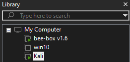
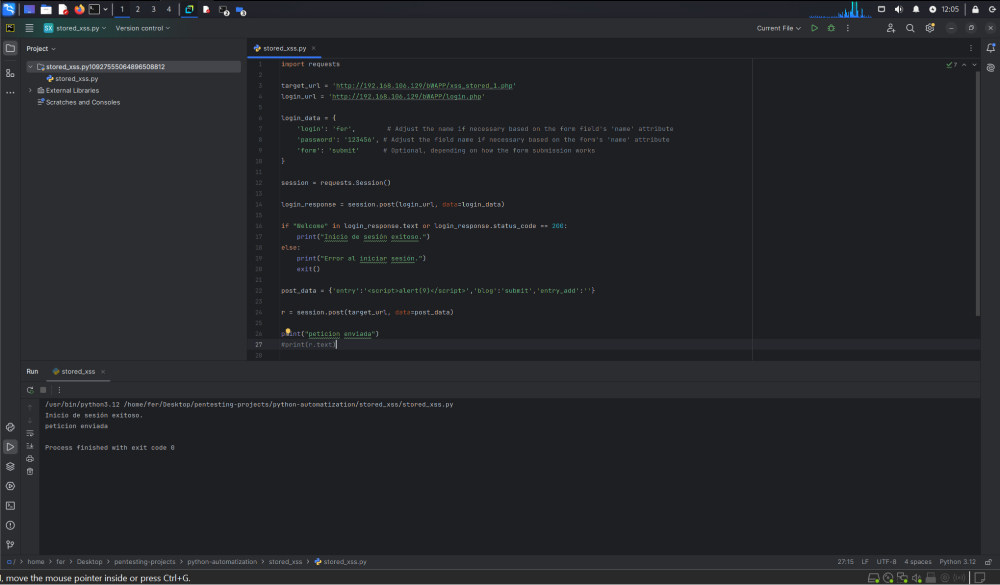
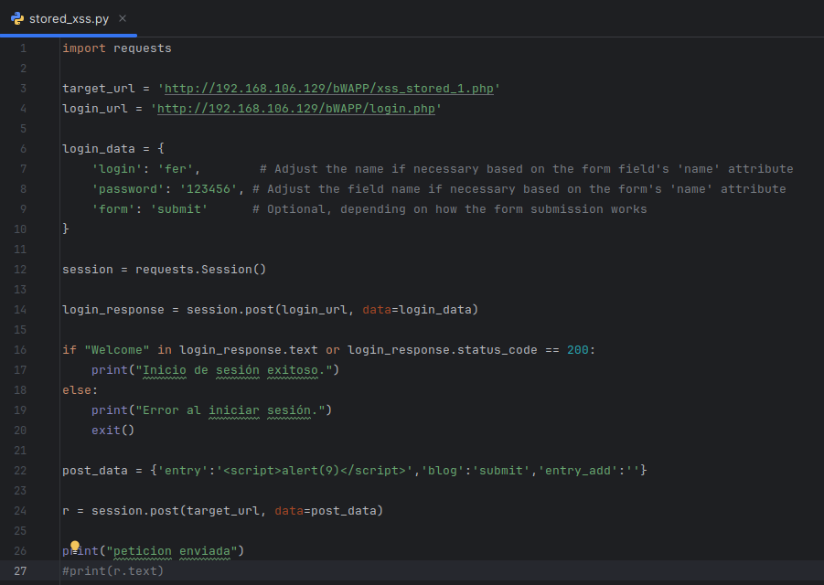
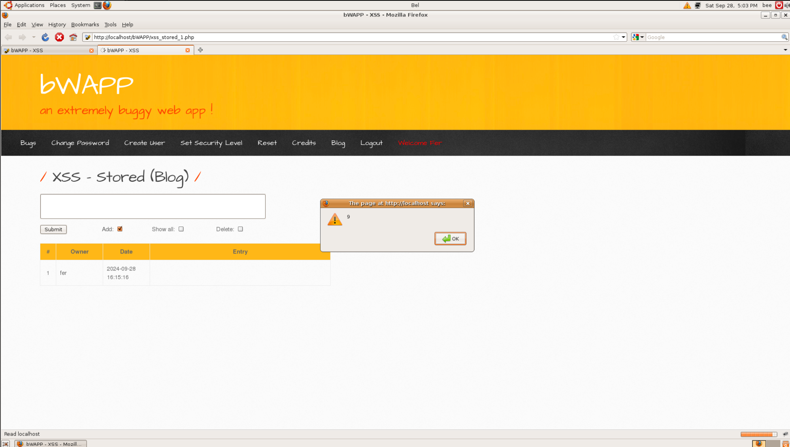

Unidad 2
ACTIVIDAD N°3

**Nombre Alumna:** Fernanda Vergara Chávez
**Nombre Profesor:** Ángel Gangas - Asistente de clases: Violeta Gangas
**Diplomado:** Red Team Avanzado
**Curso:** PENTESTING WEB AVANZADO
**Fecha de entrega:** 28/09/2024

# Introducción

Este documento evidencia un ataque de XSS almacenado donde se debe iniciar sesión en la máquina de bWAPP y luego proceder a explotar el XSS para que se refleje correctamente en el navegador.

El proceso implica autenticarse en el sitio web, capturar la cookie de sesión y luego usarla para consumir el endpoint correspondiente.

# Desarrollo

## I.  Ambiente, Herramientas y Archivos:

1. Se ha usado la máquina bee para atacar y la máquina Kali como atacante:




2. Se utilizó PyCharm para desarrollar y ejecutar el código:



## II.  Código python para el ataque:



A continuación, se desglosan las partes del código para explicar su funcionalidad:

1. Biblioteca requests: Para enviar solicitudes HTTP (GET, POST, etc.) a servidores web. Esta biblioteca facilita la interacción con APIs y sitios web.

```language
import requests
```

2. Definición de dos variables con las URLs de bWAPP:
* login\_url es la URL donde se realizará la solicitud de inicio de sesión.
* target\_url es la URL de la página donde se quiere enviar el payload XSS (una vez autenticado).

```language
target\_url = 'http://192.168.106.129/bWAPP/xss\_stored\_1.php'
login\_url = 'http://192.168.106.129/bWAPP/login.php'
```

3. Se crea un diccionario llamado login\_data que contiene las credenciales de inicio de sesión y otros campos que se envían al hacer la solicitud POST al login\_url.

```language
login\_data = {
        'login': 'fer',
        'password': '123456',
        'form': 'submit'
}
```

4. Se crea un objeto session usando requests.Session(). Esto permite que las solicitudes posteriores compartan las cookies y la información de sesión entre las solicitudes. Básicamente, session actúa como un navegador en el que todas las solicitudes "recuerdan" que ya se inició sesión.

```language
session = requests.Session()
```

5. Se realiza una solicitud POST al login\_url usando session y enviando el login\_data. Esta solicitud simula enviar el formulario de inicio de sesión y, si es exitoso, almacena las cookies de la sesión para futuras solicitudes.
* login\_response almacena la respuesta del servidor a la solicitud de inicio de sesión.

```language
login\_response = session.post(login\_url, data=login\_data) 
```      

6. Se verifica si el inicio de sesión fue exitoso buscando el texto "Welcome" en la respuesta o si el código de estado es 200. Si se cumple alguna de estas condiciones, muestra "Inicio de sesión exitoso". Si no se cumple ninguna, muestra "Error al iniciar sesión" y detiene el programa.

```language
if "Welcome" in login\_response.text or login\_response.status\_code == 200:
        print("Inicio de sesión exitoso.")
else:
        print("Error al iniciar sesión.")
        exit()
```

7. Creación de diccionario post\_data que contiene los datos que se quieren enviar al target\_url:
* 'entry': '<script>alert(9)</script>' es el campo donde se inyecta un payload XSS (cross-site scripting) para ver si se almacena en la página.
* 'blog': 'submit' y 'entry\_add': '' son campos adicionales que pide el formulario en la página de destino.

```language
post\_data = {'entry':'<script>alert(9)</script>','blog':'submit','entry\_add':''}
```

8. Se Realiza una solicitud POST a la target\_url usando session y enviando los datos post\_data. Gracias a session, se utilizan automáticamente las cookies obtenidas del inicio de sesión para autenticar la solicitud.
* r almacena la respuesta del servidor a esta solicitud.

```language
r = session.post(target\_url, data=post\_data)
```

9. Se muestra mensaje indicando que la petición se ha enviado:

```language
print("peticion enviada")
#print(r.text)
```

## Resultados y Conclusiones

Se logró automatizar el proceso de autenticación en bWAPP y explotar una vulnerabilidad XSS almacenada usando una sesión autenticada, sin necesidad de manipular manualmente las cookies. Esto demuestra cómo se pueden realizar pruebas de seguridad automatizadas y reproducibles, garantizando que el payload se ejecute correctamente en el entorno objetivo.

Se puede observar que el pop-up alert se emite y la entrada se generó:



# Referencias

* Código de python usado en clases, modificado para propósitos de la actividad y refinado con IA.
* Guia de desarrollo en clases.
