### 

**Laboratorio Módulo 1:**

**Variables de Entorno, Aliases, Historial y Archivos de Perfil**

Nombre alumna: Fernanda Vergara

Curso: Linux Shell Scripting

Profesor: Rolando Rodriguez

* * *

### INTRODUCCIÓN:

En este documento presento las respuestas al cuestionario correspondiente al Laboratorio del Módulo 1 del curso de Linux Shell Scripting.

### SECCIÓN 1: Variables

1) ¿Diferencia entre variable de entorno y de ambiente?
* Variable de entorno: Se exporta con export y se hereda por procesos hijos.

* Variable de ambiente: Generalmente es lo mismo en este contexto, pero se refiere a todas las variables accesibles por el entorno del shell.
  
  
2) Declarar variable con la palabra HOLA

VAR1="HOLA"

echo $VAR1

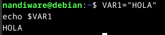

3) Declarar otra con CHAU y mostrar ambas en un solo comando

VAR2="CHAU"

echo "$VAR1 $VAR2"

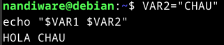

4) Variables globales más comunes

PATH, HOME, USER, SHELL, LANG, PWD, LOGNAME, HOSTNAME

5) ¿Qué significa exportar una variable?

Permite que una variable esté disponible para procesos hijos.

export VAR1

6) ¿Se heredan en una subshell?

Solo si están exportadas.

7) Listar variables de ambiente

printenv

\# o

Env

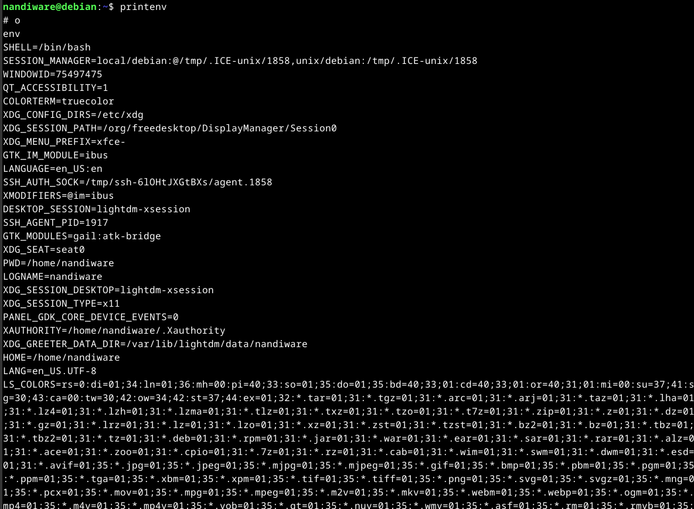

8) Exportar variables anteriores

export VAR1 VAR2

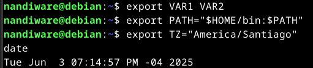

9) Modificar PATH para agregar $HOME/bin

export PATH="$HOME/bin:$PATH"

10) Modificar zona horaria

export TZ="America/Santiago"

date

11) Desconfigurar variables A y B

unset A B

*****

### SECCIÓN 2: Sustitución de Comandos, Funciones, Alias

1) Diferencias:

"": Expanden variables y comandos.

'': No expanden nada.

\`comando\` o $(comando): Ejecutan el comando.

2) Uso de $()

Ejecuta un comando y devuelve su salida.

echo "Hoy es: $(date)"

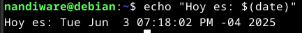

3) ¿Cuál da la hora?

echo $(date +%d)

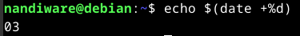

4) Ambos métodos de sustitución:

echo "Hoy: $(date)"

echo "Hoy: "\`date\`

5) Función que muestra fecha y directorio:

mi\_funcion() {

    echo "Fecha: $(date)"

    echo "Directorio actual: $(pwd)"

}

mi\_funcion

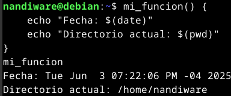

6) Listar alias seteados:

alias

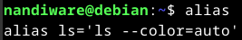

7) Alias para ls con colores:

alias ls='ls --color=auto'

8) Alias para mostrar directorio y usuario:

alias info="echo Usuario: $USER && echo Directorio: $(pwd)"

9) Prompt personalizado:

export PS1="\\d \\w \\u@$(hostname) \\$ "

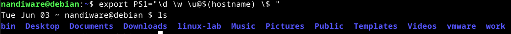

### SECCIÓN 3: Profiles

1) Archivos de profile:

/etc/profile, ~/.bash\_profile, ~/.bashrc, ~/.profile, /etc/bashrc

2) Usos:

/etc/profile: Configuración global.

~/.bash\_profile: Se ejecuta al iniciar sesión.

~/.bashrc: Configuración para cada terminal interactiva.

~/.profile: Alternativa a .bash\_profile.

3) ¿Cómo recargar el profile?

source ~/.bashrc (En Debian)

4) Modificar variables en /etc/profile o ~/.bashrc

Ejemplo (como root o con sudo):

export PATH="/root/bin:$PATH"

Sin salida - exitoso

export PS1="\\d \\w \\u@$(hostname) \\$ "

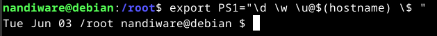

export LANG=es\_ES.UTF-8

Sin salida - exitoso

export TZ="America/Santiago"

Sin salida - exitoso

Luego, crear los usuarios:

sudo useradd user1

sudo useradd user2

sudo useradd user3

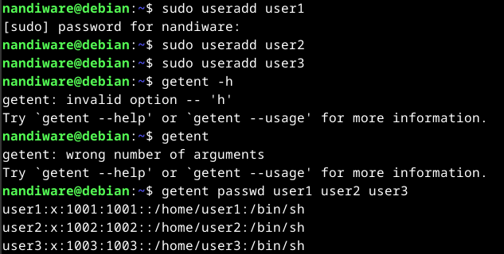

5) Mensaje de bienvenida (en /etc/motd o al final del profile):

Agregue esta línea en ~/.profile  
echo "Bienvenido a tu sistema Linux, $USER!"

luego:

source ~/.profile

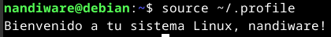

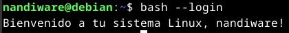

6) Alias predefinidos (en /etc/bashrc o ~/.bashrc)

alias ll='ls -la'

alias cls='clear'

alias h='history'

alias grep='grep --color=auto'

alias df='df -h'

alias du='du -sh'

alias top='htop'

alias c='clear'

alias rm='rm -i'

alias mv='mv -i'

Agredados en source ~/.bashrc

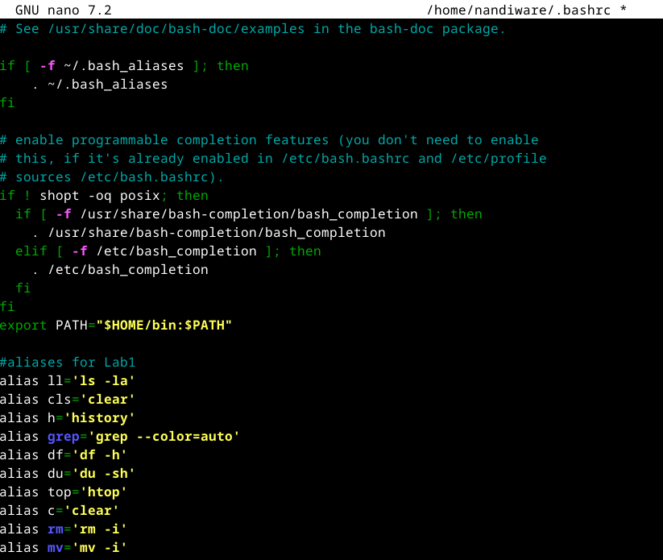

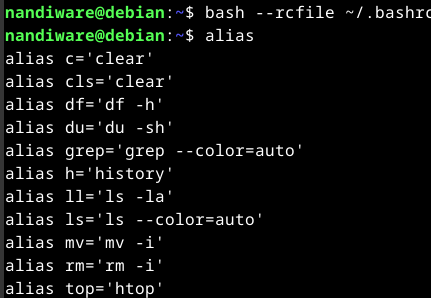

Tuve que correr:

bash --rcfile ~/.bashrc

para forzar una shell interactiva, ya que no me aparecian todos los aliases.

 

7) Borrar el history al cerrar sesión:

Agregar en ~/.bash\_logout:

history -c

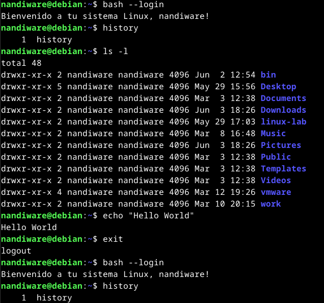

 

8) Aumentar líneas del history:

export HISTSIZE=1500

export HISTFILESIZE=3000

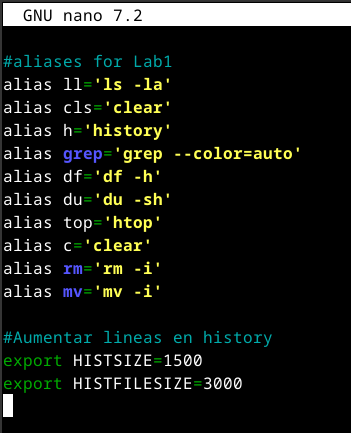

Verificando si los cambios en ~/.bashrc funcionaron:

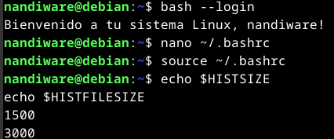
