### 

**Laboratorio Módulo 2:**

**Esenciales del Scripting en Bash – Bucles, Condicionales y Control de Flujo**

Nombre alumna: Fernanda Vergara

Curso: Linux Shell Scripting

Profesor: Rolando Rodriguez

* * *

### Primera Parte – Condicionales if y test

1) Menor de tres números

#!/bin/bash

read -p "Ingresa el primer número: " a

read -p "Ingresa el segundo número: " b

read -p "Ingresa el tercer número: " c

menor=$a

\[ "$b" -lt "$menor" \] && menor=$b

\[ "$c" -lt "$menor" \] && menor=$c

echo "El menor es: $menor"

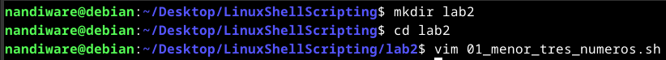

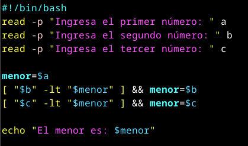

Test del script:  
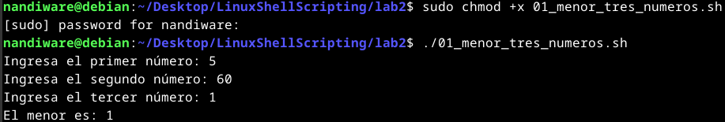

2) Mayor de tres números

#!/bin/bash

read -p "Ingresa el primer número: " a

read -p "Ingresa el segundo número: " b

read -p "Ingresa el tercer número: " c

mayor=$a

\[ "$b" -gt "$mayor" \] && mayor=$b

\[ "$c" -gt "$mayor" \] && mayor=$c

echo "El mayor es: $mayor"

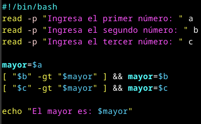

Test del script:

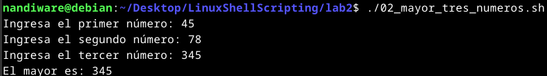

3) Comparar dos cadenas

#!/bin/bash

read -p "Ingresa una cadena: " cad1

read -p "Ingresa otra cadena: " cad2

if \[ -z "$cad1" \]; then

    echo "La primera cadena es nula"

else

    echo "La primera cadena no es nula"

fi

if \[ "$cad1" = "$cad2" \]; then

    echo "Son iguales"

else

    echo "Son distintas"

fi

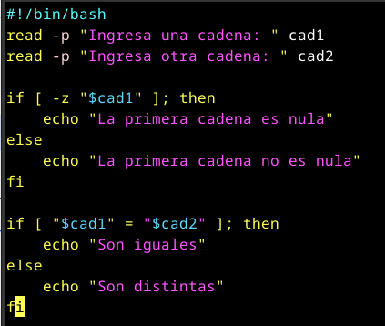

Test del script:

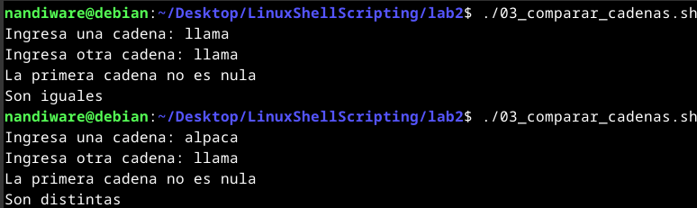

4) Comparar palabras ingresadas

#!/bin/bash

read -p "Palabra 1: " p1

read -p "Palabra 2: " p2

\[ "$p1" = "$p2" \] && echo "Son iguales" || echo "Son diferentes"

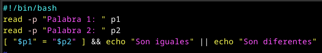

Test del script:

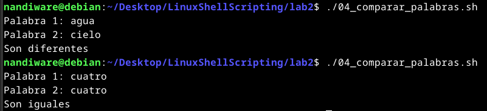

5) Verificar que exista un script y ejecutarlo

#!/bin/bash

if \[ -f "$1" \]; then

    echo "Ejecutando el script..."

    bash "$1"

else

    echo "No existe el archivo $1"

fi

Test del script:

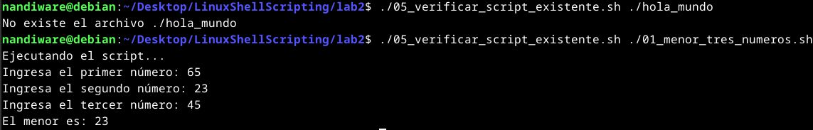

6) Simular servicio

#!/bin/bash

case $1 in

  start) echo "Iniciando servicio...";;

  stop) echo "Deteniendo servicio...";;

  status) echo "Servicio en ejecución";;

  \*) echo "Opción no válida";;

esac

Test del script:

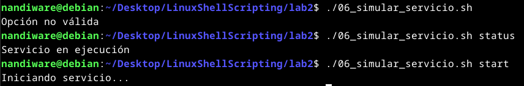

7) Copia y compresión de $HOME a otro equipo

#!/bin/bash

REMOTE\_HOST="127.0.0.1"

REMOTE\_USER="$USER"

\# 1. Hacer ping para comprobar si está activo (2 intentos, timeout 2s)

if ping -c 2 -W 2 "$REMOTE\_HOST" > /dev/null; then

    echo "Equipo remoto $REMOTE\_HOST responde al ping. Procediendo..."

    # 2. Copiar todo el home al equipo remoto (a /tmp/home\_backup)

    echo "Copiando contenido de $HOME al equipo remoto..."

    # Crear carpeta remota

    ssh "$REMOTE\_USER@$REMOTE\_HOST" "mkdir -p /tmp/home\_backup"

    # Usar rsync para copiar contenido (más eficiente y seguro que scp)

    rsync -avz --progress "$HOME"/ "$REMOTE\_USER@$REMOTE\_HOST:/tmp/home\_backup/"

    if \[ $? -eq 0 \]; then

        echo "Copia completada. Comenzando compresión remota..."

        # 3. Comprimir en remoto con tar.gz

        ssh "$REMOTE\_USER@$REMOTE\_HOST" "tar -czf /tmp/home\_backup.tar.gz -C /tmp home\_backup && rm -rf /tmp/home\_backup"

        if \[ $? -eq 0 \]; then

            echo "Compresión completada. Archivo creado en /tmp/home\_backup.tar.gz"

        else

            echo "Error durante la compresión remota."

        fi

    else

        echo "Error en la copia de archivos."

    fi

else

    echo "El equipo remoto $REMOTE\_HOST no responde al ping. Abortando."

fi

Test de script:

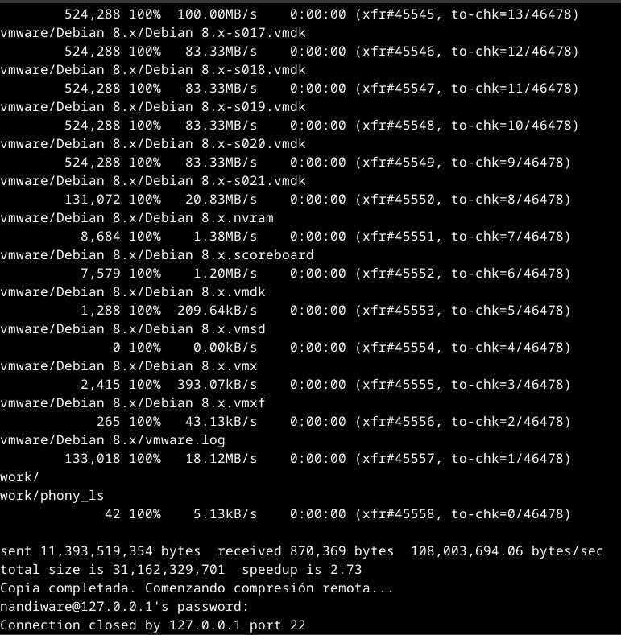

8) Letras usadas en test (\[ \])
* \-eq, -ne, -lt, -le, -gt, -ge: Comparación entre enteros
* \=, !=, -z, -n: Comparación de cadenas
* \-f, -d, -e, -r, -w, -x: Comprobación de archivos

### Case

1) Mostrar opciones del sistema

#!/bin/bash

echo "Opciones: (1) Fecha (2) Usuarios (3) Carga (4) Espacio"

read -p "Selecciona una opción: " op

case $op in

  1) date ;;

  2) who ;;

  3) uptime ;;

  4) df -h ;;

  \*) echo "Opción inválida" ;;

esac

Test de script:

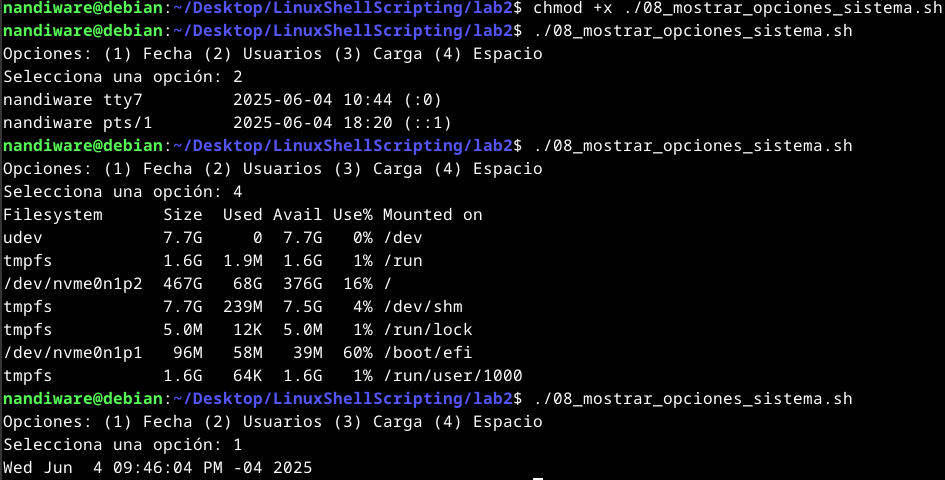

2) Case con directorio como parámetro

#!/bin/bash

DIR=$1

echo "(1) Archivos (2) Espacio (3) Punto montaje (4) Tamaño solo dir (5) Árbol"

read -p "Elige: " op

case $op in

  1) find "$DIR" -type f | wc -l ;;

  2) du -sh "$DIR" ;;

  3) df -h "$DIR" | awk 'NR==2 {print $6}' ;;

  4) du -sh --max-depth=0 "$DIR" ;;

  5) tree "$DIR" ;;

  \*) echo "Opción no válida" ;;

esac

Test de script:

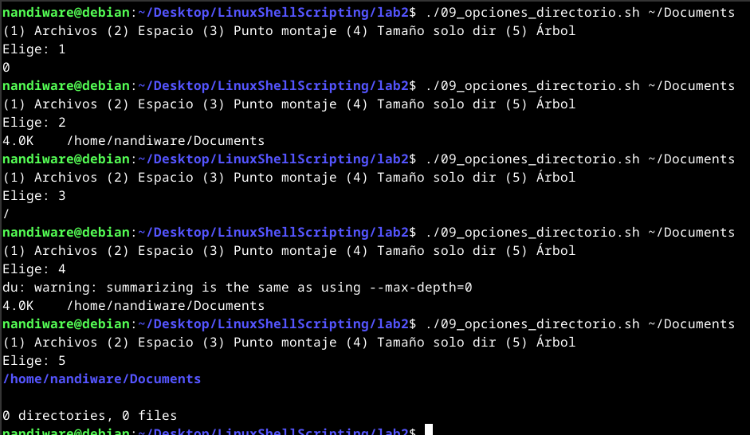

3) Funciones: sumar, restar, dividir

sumar() { echo $(( $1 + $2 )); }

restar() { echo $(( $1 - $2 )); }

dividir() { echo "scale=2; $1 / $2" | bc; }

case $1 in

  suma) sumar $2 $3 ;;

  resta) restar $2 $3 ;;

  divide) dividir $2 $3 ;;

  \*) echo "Uso: $0 {suma|resta|divide} num1 num2" ;;

esac

Test de script:

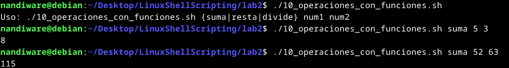

****

### Segunda Parte – Operaciones Aritméticas y Lógicas

1a) Operaciones con expr

#!/bin/bash

echo "Operadores Aritméticos"

echo "5 + 3 = $(expr 5 + 3)"

a=8

a=$(expr $a + 1)

echo "a + 1 = $a"

echo "5 mod 3 = $(expr 5 % 3)"

Test de script:

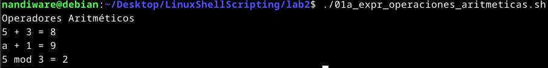

1b) Comparar con test y expr

#!/bin/bash

a=7

b=5

\# Comparación con test

if test "$a" -gt "$b"; then

    echo "$a es mayor que $b"

fi

\# Guardamos el estado de salida de test

estado\_test=$?

echo "Estado de salida de test: $estado\_test"

\# Comparación usando expr (nota el escape \\> para evitar redirección de shell)

resultado\_expr=$(expr "$a" \\> "$b")

echo "Resultado con expr: $resultado\_expr"

Test de script:

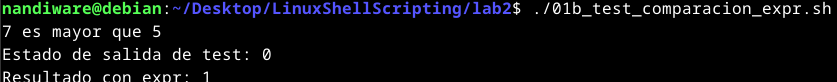

2) Operador de cadenas

#!/bin/bash

str="1234zipper43231"

echo "Tamaño: ${#str}"

echo "Posición de '2': $(expr index "$str" 2)"

echo "Subcadena desde posición 2, largo 6: ${str:1:6}"

echo "Cantidad de números al inicio: $(echo $str | grep -o '^\[0-9\]\*' | wc -c)"

echo "Dígitos al comienzo: $(echo $str | grep -o '^\[0-9\]\*')"

Test de script:

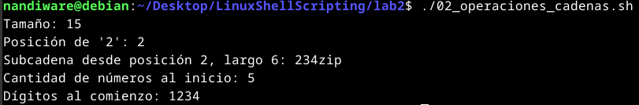

3) Hipotenusa con bc

#!/bin/bash

hipotenusa() {

    bc -l << EOF

scale = 9

sqrt($1\*$1 + $2\*$2)

EOF

}

hip=$(hipotenusa 3.68 7.31)

echo "Hipotenusa = $hip"

Test de script:

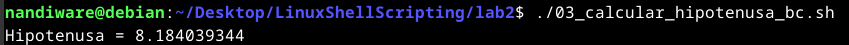

4) Comparar rutas por línea de comandos

#!/bin/bash

ruta1=$(realpath ~)

ruta2=$(realpath /tmp)

\[ "$ruta1" != "$ruta2" \] && echo "Las rutas son diferentes" || echo "Son iguales"

Test de script:

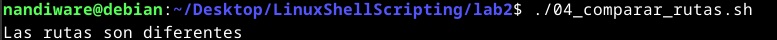

Test de script con rutas iguales:

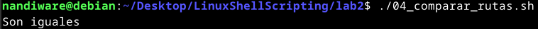
