### 

**Laboratorio Módulo 3:**

**Esenciales del Scripting en Bash – Bucles, Condicionales y Control de Flujo**

Nombre alumna: Fernanda Vergara

Curso: Linux Shell Scripting

Profesor: Rolando Rodriguez

* * *

### BUCLES: for y while

1) For de 1 a 10

for i in {1..10}; do echo $i; done

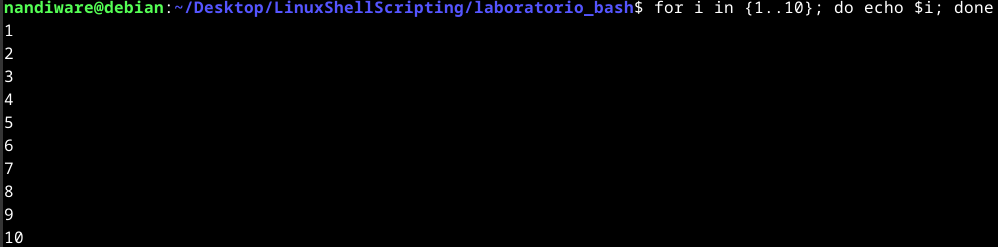

2) Crear archivos arch1 a arch10

for i in {1..10}; do touch "arch$i"; done

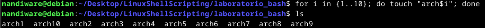

3) Mostrar "Hola Mundo" 15 veces usando seq

for i in $(seq 1 15); do echo "Hola Mundo"; done

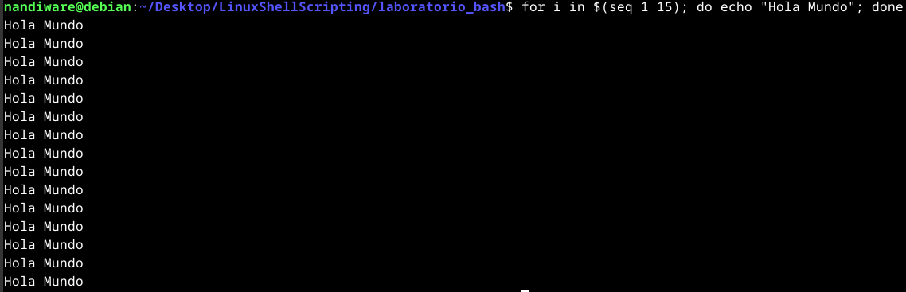

4) Abrir 10 terminales con vi y matarlos

Paso 1: Ejecutar en segundo plano:

for i in {1..10}; do vi & done

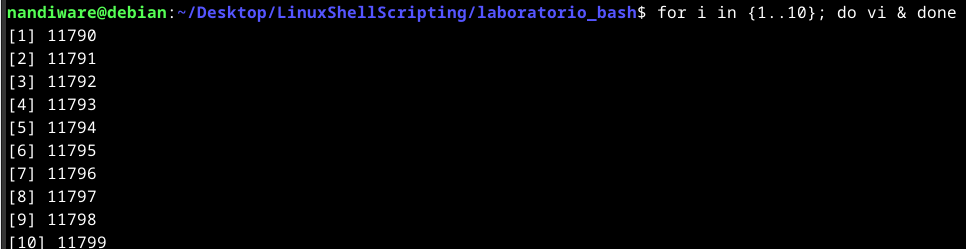

Paso 2: Matar los procesos:

ps aux | grep '\[v\]i' | awk '{print $2}' | xargs kill

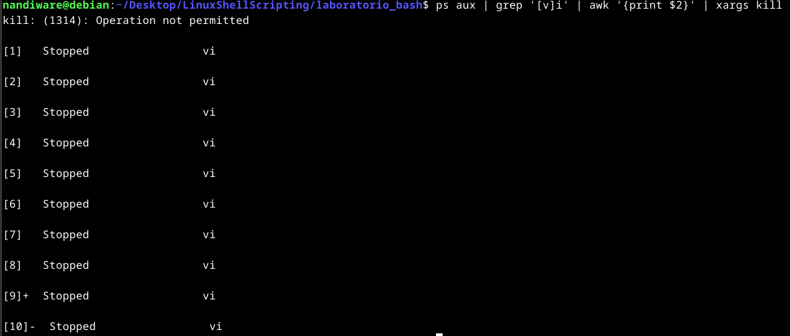

5) Script para leer un archivo línea por línea

#!/bin/bash

while IFS= read -r linea; do

    echo "$linea"

done < archivo.txt

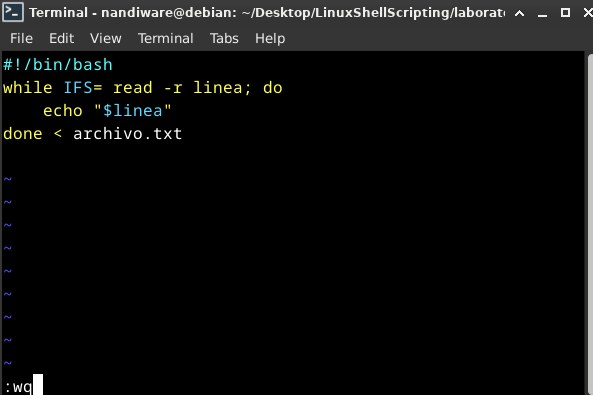

6) Script que termine al escribir "LISTO"

#!/bin/bash

while true; do

    read -p "Escribe una palabra: " palabra

    \[ "$palabra" == "LISTO" \] && break

done

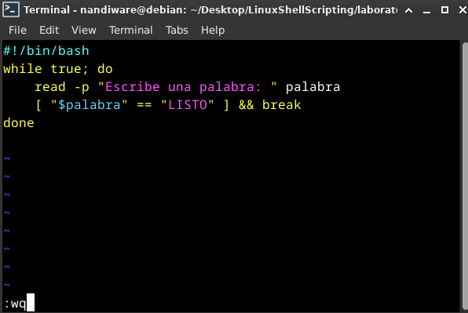

7) Script para calcular factorial (n entre 2 y 10)

#!/bin/bash

read -p "Ingresa un número (2 a 10): " num

if \[\[ $num -lt 2 || $num -gt 10 \]\]; then

    echo "Número fuera de rango"

    exit 1

fi

factorial=1

for ((i=1; i<=num; i++)); do

    factorial=$((factorial \* i))

done

echo "Factorial de $num es $factorial"

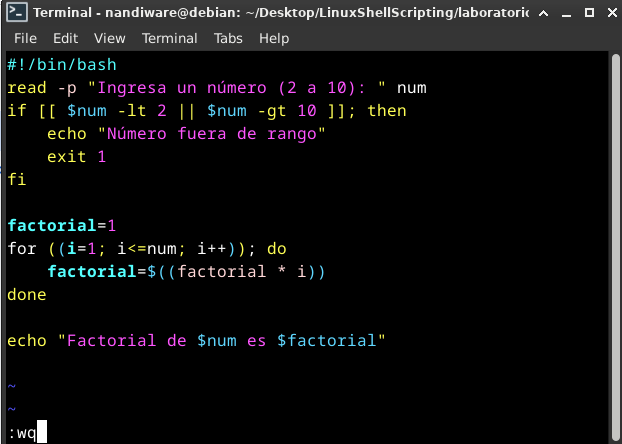

8) Ejecutar un script en modo debug

bash -x factorial.sh

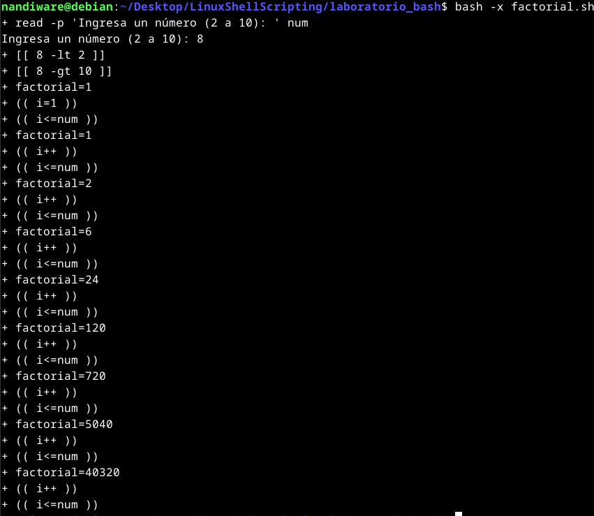

* * *

### BREAK, CONTINUE, ECHO, EXIT, GETOPTS

1) ¿Para qué sirven? (con ejemplos)

break: Sale de un bucle.

for i in {1..5}; do \[ $i -eq 3 \] && break; echo $i; done

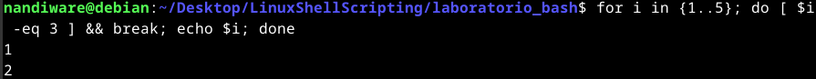

continue: Salta a la siguiente iteración.

for i in {1..5}; do \[ $i -eq 3 \] && continue; echo $i; done

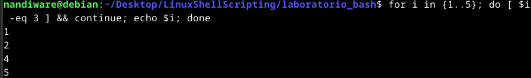

echo: Muestra texto.

echo "Hola Mundo"

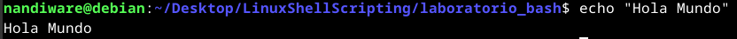

exit: Termina el script con un código de salida.

\[ "$1" == "" \] && echo "Falta parámetro" && exit 1

(Cerró mi ventana de terminal)

getopts: Manejo de parámetros tipo -h, -P, etc. (ver punto final).

2) Script que muestre números del 1 al 30 excluyendo divisibles por 2 y 3

for i in {1..30}; do

    ((i % 2 == 0 || i % 3 == 0)) && continue

    echo $i

done

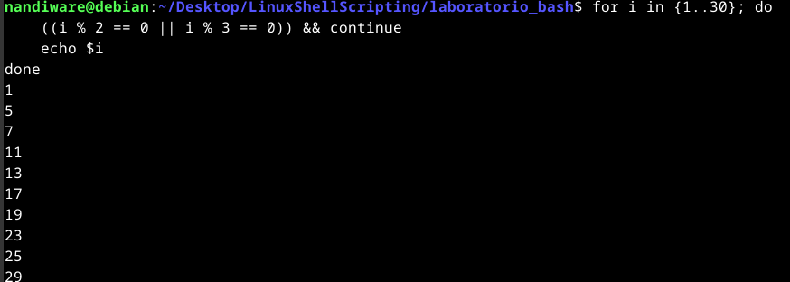

3) Cortar al encontrar divisibles por 2 o 3

for i in {1..30}; do

    ((i % 2 == 0 || i % 3 == 0)) && break

    echo $i

done

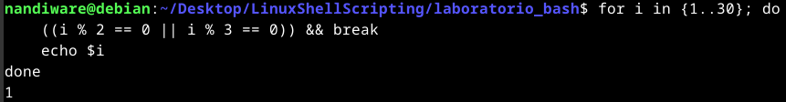

4) Bucle anidado y break 2

for i in {1..5}; do

    echo -n "Bucle $i: "

    for j in {1..5}; do

        echo -n "$j "

        \[ $j -eq 3 \] && break 2

    done

    echo ""

done

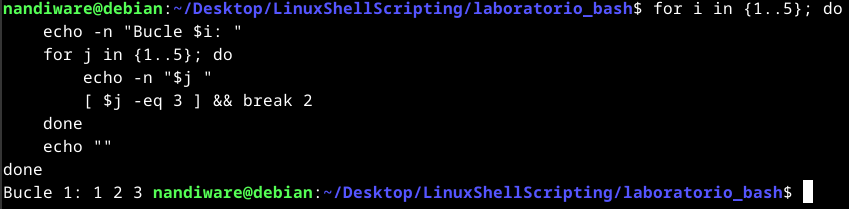

(break 2 rompe ambos bucles.)

5) Omitir solo el 3 del bucle 3

Versión que imprime solo 1 2 en bucle 3:

for i in {1..5}; do

    echo -n "Group $i: "

    for j in {1..5}; do

        if \[\[ $i -eq 3 && $j -eq 3 \]\]; then break; fi

        echo -n "$j "

    done

    echo ""

done

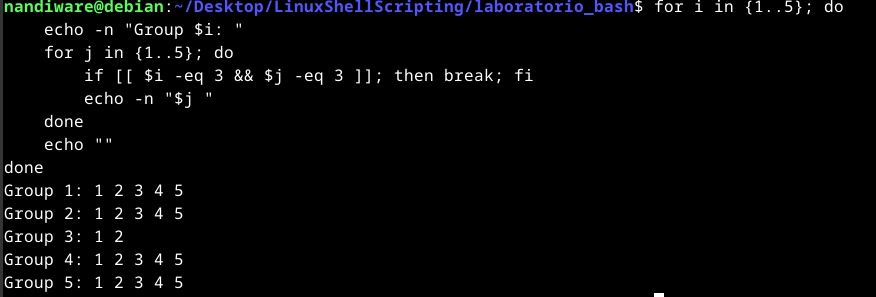

Versión que omite el 3 solo en bucle 3:

for i in {1..5}; do

    echo -n "Bucle $i: "

    for j in {1..5}; do

        if \[\[ $i -eq 3 && $j -eq 3 \]\]; then continue; fi

        echo -n "$j "

    done

    echo ""

done

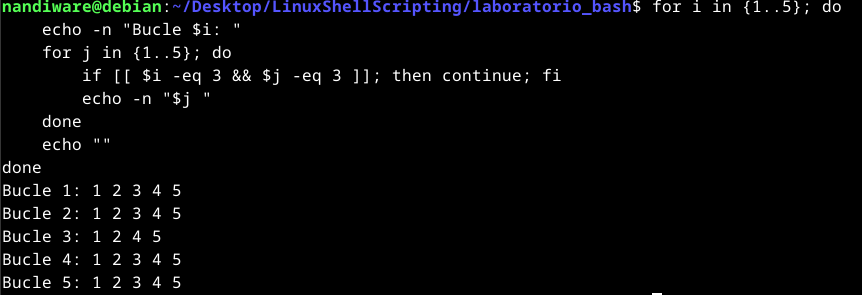

6) Parámetros comunes de echo y colores

\-e: habilita caracteres especiales como \\n, \\t

Colores:

echo -e "\\e\[1;31mTexto en rojo y negrita\\e\[0m"

echo -e "\\e\[4;32mTexto verde subrayado\\e\[0m"

echo -e "\\e\[43;30mFondo amarillo con texto negro\\e\[0m"

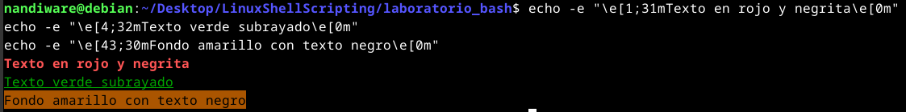

7) exit y verificación del estado

exit N termina con código N. Por convención:

0 = OK

1 = error genérico

Para comprobar:

./mi\_script.sh

echo $?  

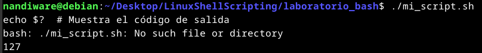

8) Script con getopts usando -h y -P

gett.sh:

#!/bin/bash

while getopts ":P:h" opt; do

    case $opt in

        P)

            echo "getopts hizo la variable OPT\_LETRA igual a 'P'"

            echo "OPTARG es '$OPTARG'"

            ;;

        h)

            echo "getopts hizo la variable OPT\_LETRA igual a 'h'"

            echo "OPTARG es ''"

            ;;

        \\?)

            echo "Opción inválida: -$OPTARG"

            ;;

    esac

done

shift $((OPTIND -1))

echo "Ignorando los primeros \\$OPTIND-1 = $((OPTIND -1)) argumentos"

echo "Lo que sobró de la línea de comandos fue '$\*'"

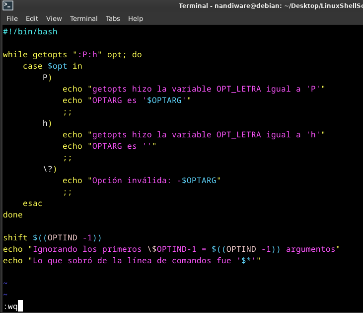 

chmod +x gett.sh

./gett.sh -P impresora -h arch1

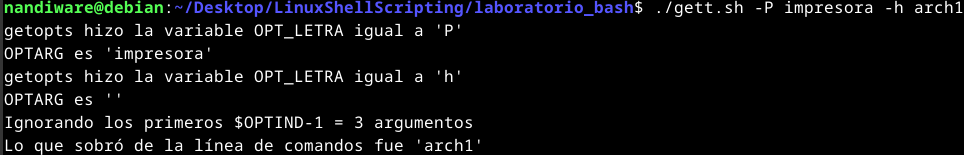
