### 

**Laboratorio Módulo 4:**

**Lab final: Multi-Shell Scripting**

Nombre alumna: Fernanda Vergara

Curso: Linux Shell Scripting

Profesor: Rolando Rodriguez

* * *

### Parte 1 – Scripting en Bash

1\. Leer un archivo línea por línea usando arrays

#!/bin/bash

\# Lee un archivo línea por línea y guarda en array

read -p "Ruta del archivo a leer: " archivo

if \[\[ ! -f "$archivo" \]\]; then

    echo "Archivo no encontrado"

    exit 1

fi

mapfile -t lineas < "$archivo"

echo "Contenido leído línea por línea:"

for linea in "${lineas\[@\]}"; do

    echo "$linea"

done

Test de script:

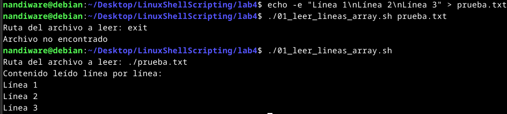

2\. Crear un menú de operaciones sobre archivos

#!/bin/bash

confirmar() {

    read -p "$1 (s/n): " confirm

    \[\[ "$confirm" == "s" || "$confirm" == "S" \]\]

}

menu() {

    echo "1) Copiar archivo"

    echo "2) Borrar archivo"

    echo "3) Comprimir archivo"

    echo "0) Salir"

    read -p "Elige una opción: " op

}

while true; do

    menu

    case $op in

        1)

            read -p "Archivo a copiar: " origen

            read -p "Destino: " destino

            if \[\[ -e "$destino" \]\]; then

                confirmar "El archivo ya existe. ¿Sobrescribir?" && cp "$origen" "$destino"

            else

                cp "$origen" "$destino"

            fi ;;

        2)

            read -p "Archivo a borrar: " archivo

            if \[\[ -e "$archivo" \]\]; then

                confirmar "¿Estás seguro de borrar $archivo?" && rm "$archivo"

            else

                echo "Archivo no encontrado"

            fi ;;

        3)

            read -p "Archivo a comprimir: " archivo

            salida="${archivo}.tar.gz"

            if \[\[ -f "$salida" \]\]; then

                confirmar "El archivo comprimido ya existe. ¿Sobrescribir?" && tar czf "$salida" "$archivo"

            else

                tar czf "$salida" "$archivo"

            fi ;;

        0) break ;;

        \*) echo "Opción inválida" ;;

    esac

done

Test de script:

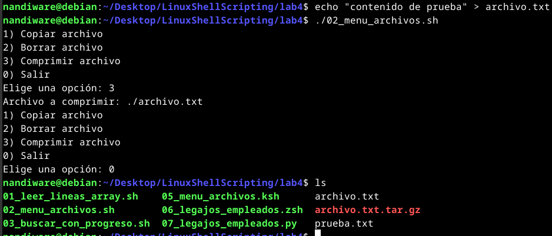

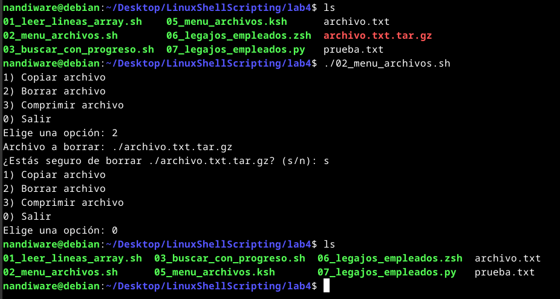

3\. Buscar archivos y mostrar barra de progreso

#!/bin/bash

read -p "Directorio a analizar: " dir

archivos=($(find "$dir" -type f))

total=${#archivos\[@\]}

for i in "${!archivos\[@\]}"; do

    echo -ne "Procesando $((i+1))/$total archivos\\r"

    sleep 0.05  # Simula tiempo de proceso

done

echo -e "\\nProceso completado"

Test de script:

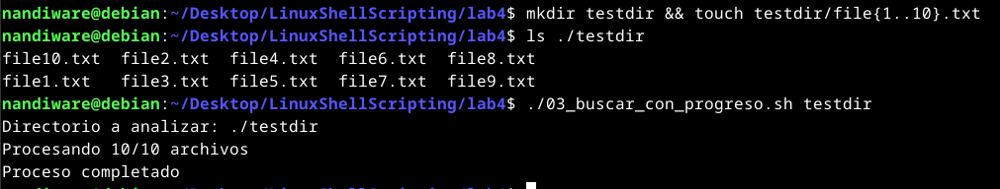

4\. Imprimir líneas que contienen "(root)" usando

awk '/\\(root\\)/' archivo.txt

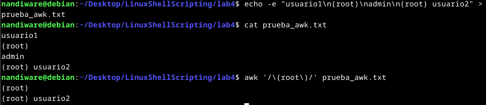

* * *

### Parte 2 – Otros intérpretes de comandos

5\. Repetir el menú (Ejercicio 2) pero en ksh

#!/bin/ksh

confirmar() {

    print -n "$1 (s/n): "

    read confirm

    \[\[ "$confirm" = "s" || "$confirm" = "S" \]\]

}

menu() {

    print "1) Copiar archivo"

    print "2) Borrar archivo"

    print "3) Comprimir archivo"

    print "0) Salir"

    print -n "Elige una opción: "

    read op

}

while true; do

    menu

    case $op in

        1)

            print -n "Archivo a copiar: "

            read origen

            print -n "Destino: "

            read destino

            if \[\[ -e "$destino" \]\]; then

                confirmar "El archivo ya existe. ¿Sobrescribir?" && cp "$origen" "$destino"

            else

                cp "$origen" "$destino"

            fi ;;

        2)

            print -n "Archivo a borrar: "

            read archivo

            if \[\[ -e "$archivo" \]\]; then

                confirmar "¿Estás seguro de borrar $archivo?" && rm "$archivo"

            else

                print "Archivo no encontrado"

            fi ;;

        3)

            print -n "Archivo a comprimir: "

            read archivo

            salida="${archivo}.tar.gz"

            if \[\[ -f "$salida" \]\]; then

                confirmar "El archivo comprimido ya existe. ¿Sobrescribir?" && tar czf "$salida" "$archivo"

            else

                tar czf "$salida" "$archivo"

            fi ;;

        0) break ;;

        \*) print "Opción inválida" ;;

    esac

done

Test de script:

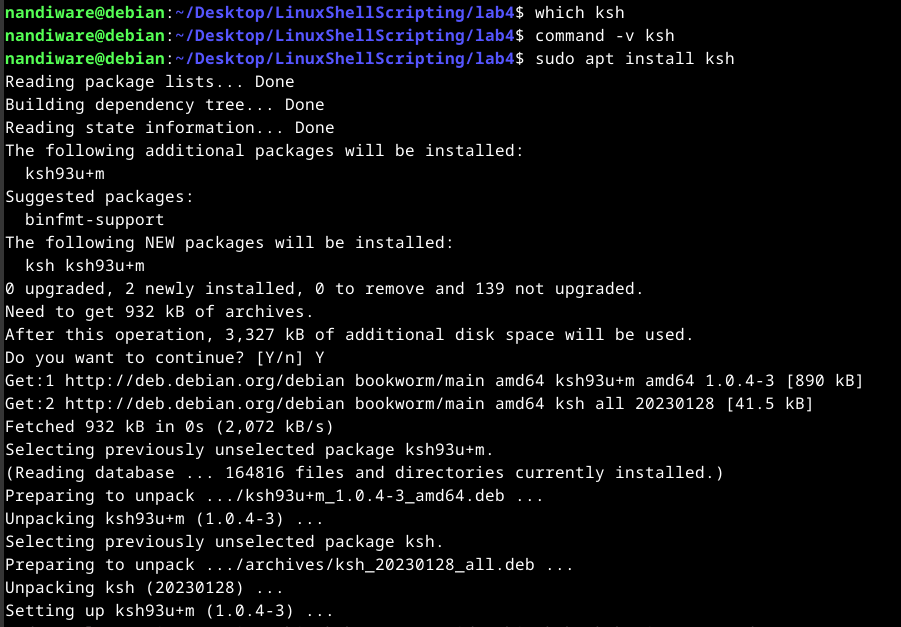

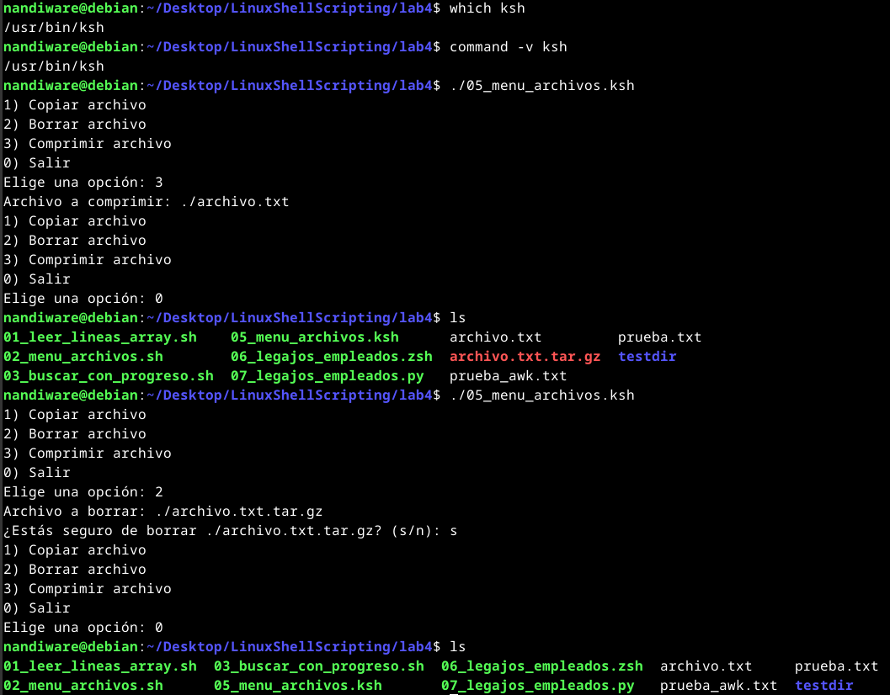

6\. Lista de empleados con legajo y nombre en zsh

Usar un hash (typeset -A) porque es la estructura más adecuada para pares clave-valor (legajo/nombre).

#!/bin/zsh

typeset -A empleados

empleados=(

    1001 "Ana Pérez"

    1002 "Luis Soto"

    1003 "Carla Díaz"

)

for legajo nombre in ${(kv)empleados}; do

    echo "Legajo: $legajo - Nombre: $nombre"

done

Test de script:

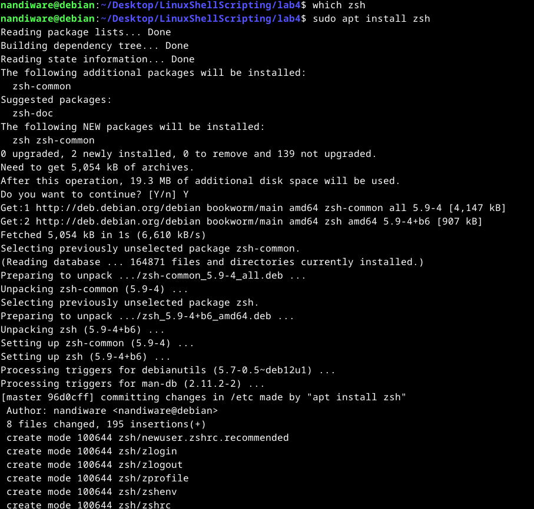

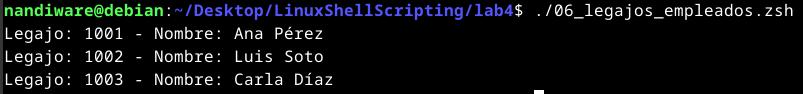

7\. Repetir con Python

#!/usr/bin/env python3

empleados = {

    1001: "Ana Pérez",

    1002: "Luis Soto",

    1003: "Carla Díaz"

}

for legajo, nombre in empleados.items():

    print(f"Legajo: {legajo} - Nombre: {nombre}")

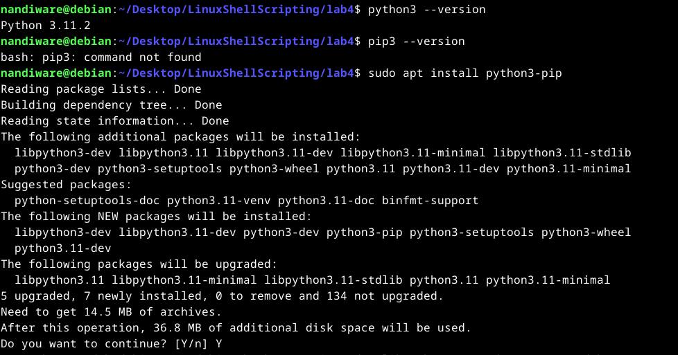

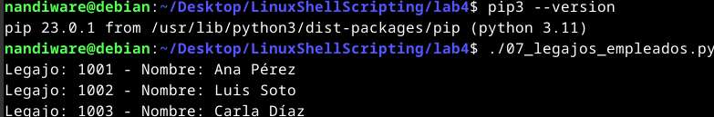

